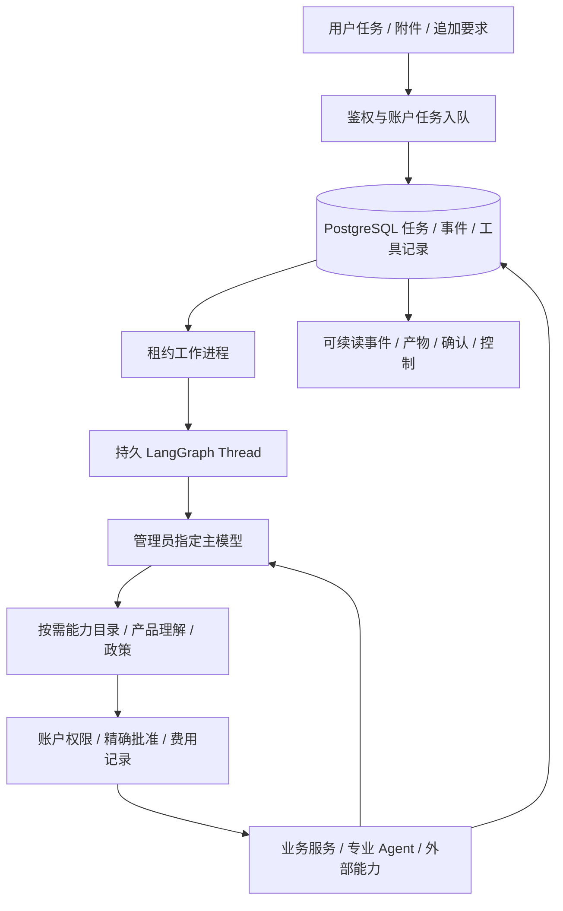

# 产品主 Agent 与开放式工具架构

本文件是 2026-09-20 用户提供的 P0–P6 计划的实施跟踪。规则来源见 [MA01–MA09](CONFIRMED_PRODUCT_RULES.md)。确认、实现、本地验证和真实验收分别记录；未完成的阶段不得写成已发布。

当前阶段新增 30 项可调用适配器的[自动生成目录](MAIN_AGENT_TOOL_CATALOG.md)。P4/P5 基础包含 Skill 包导入、全局发布确认与任务版本绑定、带来源的偏好/政策及撤销、一次/间隔/每周定时任务和管理面板；完整阶段仍未验收。具体缺项和真实/模拟结果见[验收记录](MAIN_AGENT_ACCEPTANCE.md)。

运行 Skill/记忆/调度前应用迁移 093–095。`assistant:worker` 先领取到期计划，再处理 Agent 任务；每次计划生成独立对话与任务，按 occurrence key 防止重复入队。运行中、等待确认、暂停或部分完成的前次任务阻止周期重叠。下一次时间以实际恢复时刻计算，跳过漏掉的周期；夏令时不存在的时间跳过、重复的时间仅取首次。停用计划不取消已执行的工作。恢复顺序：数据库迁移、LangGraph 服务、主任务 worker、Web；回退主入口配置不删新任务和费用记录。

可选沙箱镜像通过 `docker build -f Dockerfile.agent-sandbox -t codex-agent-sandbox:1 <空目录>` 构建，然后配置 `AGENT_SANDBOX_IMAGE=codex-agent-sandbox:1`。仅挂载临时任务输入目录；网络关闭，无宿主凭据、仓库或 Docker Socket 挂载。当前 Docker Hub 拉取失败，未验证真实脚本执行，不应报告沙箱已上线。尚未提供 MCP/API、联网浏览器代理与接管；Git/URL Skill 获取和历史记忆统一也未完成。其余工具在这些依赖缺失时保持独立可用。

验证命令：`node scripts/run-tsx.cjs scripts/generate-main-agent-catalog.ts --check`、`node scripts/run-tsx.cjs scripts/verify-main-agent-db.ts`、本机启动后 `node scripts/run-tsx.cjs scripts/verify-main-agent-ui.ts`。数据库和浏览器测试创建并清理隔离的合成账户，不调用付费模型或发送邮件。运行时聚合指标与私有正文分开，目录与[效率台账](PRODUCT_WORKFLOW_EFFICIENCY_LEDGER.md)同步维护。

## 目标与边界

主 Agent 理解开放式任务，自主选择和组合产品能力。意图标签仅用于统计。LangGraph 是唯一业务编排运行时；Next.js 负责鉴权、入队、事件和控制。现有完整工作流作为兼容组合工具保留。RAG v3 数据、Gold/holdout 和正式评分标准不重建、不重定义。

## 分阶段状态

| 阶段 | 工作 | 实现状态 | 验收状态 |
|---|---|---|---|
| P0 | 规则、能力盘点、基线 | 已记录 9 组规则、53 个 API、旧门禁与依赖 | 基线测试 1191 通过、2 项旧费率日期失败 |
| P1 | 主模型工具循环、产品包、通用任务、读取能力 | 初始实现：9 个读取工具、任务/事件/租约/检查点、控制 UI | 8 项单元与 15 项真实数据库检查通过；真实模型与进程重启闭环待验 |
| P2 | 独立业务工具、解除不必要前置依赖 | 已接入部分写工具、独立市场计划/草稿修改；全产品覆盖未完成 | 局部测试通过，阶段未验收 |
| P3 | 集中确认、费用提示、私有上下文、独立/批次邮件 | 单项精确批准、共享费用观察配置、无公司邮件/附件已接入；批次及旧页面批准存储待接入 | 24 项数据库边界检查通过；真实主模型 HTTP 403，阶段未验收 |
| P4 | Skill、连接、隔离脚本与浏览器 | 待实施 | Docker 服务权限尚未验证 |
| P5 | 统一记忆、后台与定时任务、完整 UI | 待实施 | 未验收 |
| P6 | 80 开发 + 40 锁定任务、真实闭环、灰度发布 | 待实施 | 未执行；完成率未知 |

## 执行与恢复合同

工具合同包含标识/版本、输入输出 Schema、角色与连接、数据依赖、副作用、幂等恢复、费用已知/估计/未知。身份由服务端注入。结果区分成功、部分完成、缺少输入、等待确认、暂不可用、执行结果未知；提供方故障不等于业务不合格。

每次工具执行先持久化参数和动作身份，再执行并保存结果。已完成动作恢复时复用；外部副作用回执未知必须核对，不能自动重发。主模型同一路由最多一次自动重试，不静默切换私有数据接收方。无新状态的重复调用触发停滞保护。暂停/取消在安全边界生效，已发生费用与已发送邮件保留。

邮件确认绑定最终收件人、正文、附件及版本；精确批次逐项绑定，某封修改仅使该项失效。批准由已登录用户产生，模型不能提交批准令牌。定时任务授权不替代每次最终发信确认。

## 配置与数据

默认主模型 OpenRouter `openai/gpt-5.6-sol`；管理员可配置。私有任务资料允许进入该指定路由，凭据不能进入提示。禁止供应商数据收集，无配置的等效路由不备用。网页、Skill 和第三方返回值视为资料，不得改变权限或批准记录。

管理员发布 Skill 后全账户可用，成员仅本人；运行任务固定版本。脚本与浏览器在 Docker Linux 隔离环境执行，缺依赖则返回不可用，不直接在宿主执行。全局强制政策独立存储，优先于个人默认方法。

通用任务状态：queued / running / waiting_user / paused / partial / completed / failed / cancelled。定时任务保存时区（账户无配置时 Asia/Shanghai）、范围和下一次时间，默认不重叠、不补跑所有遗漏周期。

## 验收与效率

能力盘点见 [能力迁移清单](MAIN_AGENT_CAPABILITIES.md)。所有工作流阶段记录输入、有效输出、实际下游使用、tokens/API credits、已知/未知费用、延迟、重试、丢弃原因、利用率和优化机会。私有载荷与可提交的聚合遥测隔离。真实完成率、误追问率、费用和供应商延迟不能从模拟测试推断。

发布门槛：40 条锁定验收至少 95% 端到端完成；权限/边界全部通过；跨账户泄漏、未经批准外发、伪造回执、重复发送均为零。全部盘点能力可调用，原评分与证据合同通过。先管理员、后工作账户灰度；未达门槛保持兼容入口。

## 部署与回退

新增表采用增量迁移和强制 RLS。旧运行任务保留旧执行版本。发布切换通过运行配置完成，回退不删除任务、费用、记忆和执行记录。具体启动与验证命令随对应阶段补充。

P1：应用迁移 090；启动原 `npm run langgraph:dev` 和新增 `npm run assistant:worker`；通过部署环境设置 `MAIN_AGENT_ROLLOUT=admin` 先开放管理员（`all` 为全账户，空值回退）。主模型/接收方通过 `MAIN_AGENT_MODEL` / `MAIN_AGENT_PROVIDERS` 配置，新任务固定该配置。运行 `node scripts/run-tsx.cjs scripts/verify-main-agent-db.ts` 验证数据库。该验证仅清理自己创建的合成账户，不调用供应商。真实发信/脚本/浏览器工具尚未开放。

P2/P3 基础：继续应用 091/092；配置 `PRODUCT_FINANCIAL_POLICY=observe` 在页面和工具共用费用层启用 MA05。主 Agent 的发信工具进入精确批准，脚本/浏览器未开放。`verify-main-agent-live.ts --live` 是显式真实调用检查，保留费用/调用记录；当前路由 HTTP 403，不能切换为默认入口或宣称 P6 达标。
