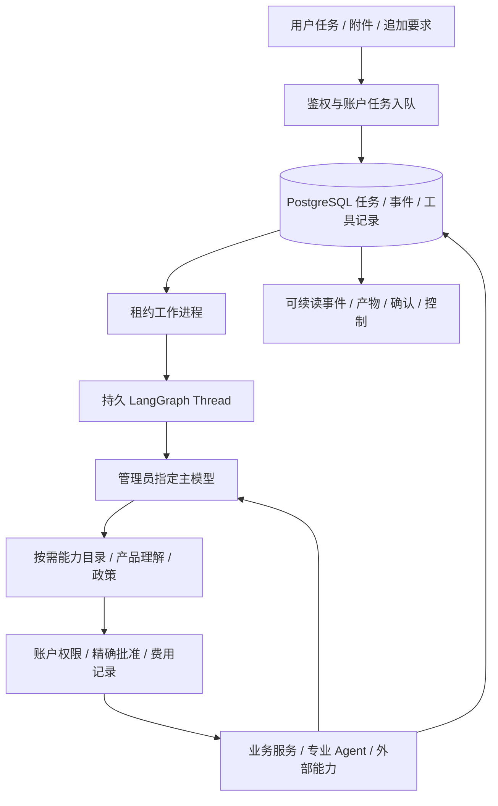

# 产品主 Agent 与开放式工具架构

## MA13 quality-first development priority (confirmed 2026-09-21)

Development stages now spend engineering and model effort on completing product flows and improving output quality. They no longer update the development efficiency ledger or automatically generate expense reports. Historical ledger entries stay unchanged. Durable provider receipts may retain raw fields needed to resume a task, prevent duplicate effects or perform an explicitly requested reconciliation, but routine verification does not aggregate cost, token or utilization metrics. Acceptance evidence continues to record behavior, permissions, exact effects, failures and quality findings.

## MA11 current milestone (confirmed 2026-09-21)

The current deliverable is a verifiable main-Agent architecture using existing product business workflows. New MCP, network-browser and private-Git connections are later work. Preserve existing detailed pages, formal scoring, RAG v3 and account ACL. The chat becomes the single `/` entry with owned `/c/[id]` deep links, one navigation sidebar, durable event-cursor progress and exact final-action approvals. GLM Batch waiting shows queue/execution and elapsed time. The palette and acceptance values are recorded exactly in [MA11](CONFIRMED_PRODUCT_RULES.md).

Coverage continuation: the registry now exposes 88 tools. The latest shared-service adapters cover workspace mode, feedback regeneration, mailbox screening/learning/lifecycle, mailbox connection shutdown/deletion, stale-operation reconciliation, administrator Gold review, approved mailbox knowledge and exact-approved shared-text knowledge publication. Credentials never enter tool inputs, and publish/destructive effects retain central approval. [The capability matrix](MAIN_AGENT_CAPABILITY_COVERAGE_MA11.md) lists the smaller remaining current-scope gaps and separates later MCP/browser/private-Git work.

Stage evidence is separate: confirmation here is neither a tool implementation nor a passing replay. The 120 isolated data-copy replays exercise Graph, worker, tools and persistence; controlled external-send substitutes cannot count as real model planning. Eight configured GLM Batch tasks are reported separately. Locked architecture/workflow acceptance requires at least 38/40 plus every specified critical boundary. The entry remains configuration controlled and passing this milestone does not imply full release. The original MA09 gate stays in version history.

Implementation stage: `/` renders a blank composer even when the account has history; `/c/[id]` checks ownership server side and restores the selected conversation. Existing market paths stay intact. The sidebar owns conversation history and feature entry points; settings holds Skill, memory and schedule controls outside the message stream. `AgentRuns` reads account-scoped saved cursor pages and the latest persisted Batch state. A page refresh starts at cursor zero and continues until caught up; incomplete tool results display their stored status and missing fields. Batch polling is receipt-only and UI time is elapsed time, not generated-token animation. [Synthetic desktop/mobile and database evidence](MAIN_AGENT_ACCEPTANCE.md). Current release scope is still configuration controlled.

The optional `lead_workflow` adapter uses the exact-approved existing lead-search action and queues its normal worker/Graph path. Migration 098 binds one action to one durable Agent call so a lost parent receipt can be reconciled without creating a second job. Queue state and task URL are returned as artifacts, while provider/workflow completion is checked separately. [Generated coverage](MAIN_AGENT_CAPABILITY_COVERAGE_MA11.md) lists every registered tool and the page-only/missing gaps. This adapter has passed unit/schema checks, not a positive real worker execution or model-selection test.

MA11 architecture replay uses `scripts/replay-main-agent-ma11.ts`: `--prepare` clones the local PostgreSQL source and freezes a private 80/40 source-ID/version/hash manifest under ignored `tmp/`; `--run` executes deterministic model decisions through the actual Graph/checkpointer, registered read tools, tenant boundaries, approval/call journal and targeted worker leases, then drops the clone. `--cleanup` removes a stranded clone after interruption. External send checks use a controlled in-process substitute. [Replay evidence](MAIN_AGENT_ACCEPTANCE.md) is separate from eight actual GLM Batch selections and from business answer quality.

The eight-case live verifier is prepared but requires explicit authorization for private account data to reach OpenRouter/Fireworks GLM Batch. Its `--start`/`--poll` paths require `--allow-private-provider-data`; `--reconcile` is read-only. The first sandboxed submission remained locally uncertain and a provider listing showed zero batches in its time window. Auto-review rejected the subsequent private-data submission before execution, so [the acceptance log](MAIN_AGENT_ACCEPTANCE.md) keeps actual model selection and cost unknown. The main entry remains configuration controlled.

MA12 (2026-09-21) now gives the exact private-data authorization for these eight verification tasks and their necessary continuation turns to configured OpenRouter/Fireworks GLM Batch. The earlier rejection and uncertain sandbox attempt remain historical. Resume with a fresh isolated clone and saved Batch IDs; record real model selection, valid outputs, costs and latency separately from deterministic replay. No SMTP send, publishing, deletion or full release is authorized by MA12.

Execution checkpoint: all eight first-turn Batch submissions have distinct saved remote IDs and provider status `in_progress`. The verifier polls those IDs and inspects each returned tool choice against a read-only allowlist before resuming the Graph; it stops a task after eight saved Batch turns. Admission acknowledgements are not answers. Results and billing remain pending in [the acceptance log](MAIN_AGENT_ACCEPTANCE.md).

Later checkpoint: all eight first model decisions are saved. The model used `describe_tool` before target reads; two runs have since executed account-scoped read tools and continued through saved Batch turns. Invalid version-suffixed names are preserved as model-selection failures and safely handled by the registered-tool dispatcher. A single `--watch --allow-private-provider-data` process now polls only the eight saved runs every 120 seconds, stops at eight Batch turns per task or after 48 hours, and writes a private report under ignored `tmp/`. Its exclusive local lock prevents a second watcher. The isolated database clone must be retained while turns are pending and cleaned only after terminal reporting. [Current aggregate tokens, cost and unknowns](MAIN_AGENT_ACCEPTANCE.md) remain separate from the 120 deterministic replay.

## P5 historical manual memory save - 2026-09-21 (partial)

`legacy_memory_save` uses the existing page's manual-memory editor and persistence service for account-owned email style or explicitly approved marketing claims. The central hook requires exact approval; edit inputs include the observed update revision and cannot target source-managed company classifications. Unchanged content reuses the existing embedding, while content changes use the configured embedding provider and retain an unknown bill until reconciled. This bridges the historical store but does not merge every legacy record into the new versioned memory tables. [Verification](MAIN_AGENT_ACCEPTANCE.md).

## P2/P5 private task attachment entry - 2026-09-21 (partial)

An authenticated account can queue a **private** PDF/PPTX/XLSX extraction job without the shared-upload administrator token. Shared uploads still require the administrator role and token. The main composer lists only already registered private/shared original assets, passes selected IDs to the existing server-side owner/registration check and retains the user's text on send failure. Newly uploaded files are clearly pending until local extraction and registration; they are not silently attached. Legacy conversation mode explicitly rejects a selected attachment instead of ignoring it. The picker currently shows the first 50 assets per scope; text-file import and processing-state refresh inside the composer remain open. [Verification](MAIN_AGENT_ACCEPTANCE.md).

## P2 independent follow-up drafts - 2026-09-21 (partial)

The existing follow-up page and new `follow_up_list`/`follow_up_generate` tools use a common service. An owned sent parent message supplies bounded thread, inbound and style context; generation records an encrypted draft and usage receipt, without sending. The tool can be chosen without rerunning a development strategy. The current context service still requires a company-linked parent; unassociated mail returns a concrete missing-context result and needs a separate extension. [Verification](MAIN_AGENT_ACCEPTANCE.md).

## P2 mailbox candidate review - 2026-09-21 (partial)

`mailbox_candidate_list` reads only pending candidates owned by the current account, including the private content and its hash. The page uses the same read service. `mailbox_candidate_review` accepts a candidate ID, observed content hash and approve/reject decision; central confirmation is required before this tool can publish private knowledge, and the row-locked review service rejects changed content. The existing page still makes its own direct review call. An unknown embedding result during approval remains recoverable under the existing service rules; no live embedding was invoked in this stage. [Verification](MAIN_AGENT_ACCEPTANCE.md).

## P2 version-bound draft updates - 2026-09-21 (partial)

`draft_read` exposes an owned draft body and current revision; `draft_edit`, new `draft_approve` and the existing draft page now use the same row-locked update service. The page and tool submit the revision they read; a stale revision returns a conflict before writing, and the page carries the returned revision into its next save. Identical approval stays idempotent; editing approved text advances the revision and returns the draft to generated. Approval saves internal draft status only and never sends mail. Legacy internal callers retain the compatibility service, while the public PATCH endpoint requires a current revision. Full outreach tool coverage and P6 acceptance remain open. [Verification](MAIN_AGENT_ACCEPTANCE.md).

## P3 cost and usage observation read - 2026-09-21 (partial)

`task_usage_read` and `/api/tasks/usage` now call the same account-scoped service for the last 30 days. Operational metrics, HTTP attempts, workflow stages and model usage remain separate arrays; their amounts are not additive, and missing bills stay unknown. The tool makes existing diagnostics available for planning without modifying spend admission or sending any provider request. [Verification](MAIN_AGENT_ACCEPTANCE.md).

## P2 knowledge library and history adapters - 2026-09-20 (partial)

`knowledge_library_list` browses private, shared or public evidence with bounded pages; document rows include a content hash for versioned actions. `knowledge_revision_list` reads account-owned prior content without changing RAG v3. `knowledge_upload_jobs` reports existing extraction jobs. `knowledge_private_delete` requires central exact approval of document ID and observed content hash, then calls the same owned private-document deletion service as the page. The existing page confirmation remains separate. Binary upload/processing, shared publication and other knowledge administration remain outstanding. [Verification](MAIN_AGENT_ACCEPTANCE.md).

## P3/P5 standalone mail task visibility - 2026-09-20 (partial)

The shared task feed and detail query include account-owned outbound mail with nullable company/workspace. Linked mail still shows its company; standalone mail gets a generic title and a null company in details. Both page and Agent task tools use these services. An unknown send result remains unknown and needs reconciliation; listing it cannot trigger SMTP or infer a company business state. [Verification](MAIN_AGENT_ACCEPTANCE.md).

## P2 saved company detail reads - 2026-09-20 (partial)

The saved assessment and company correspondence page routes now call the same owner-scoped services as `company_assessment_read` and `company_correspondence_list`. The former returns the latest persisted formal score and scoring policy snapshot; it never rescored. The latter returns linked message metadata and decrypted subject only, with a bounded cursor; message body still requires a separate owned `mail_read`. No discovery, model or mailbox sync prerequisite is introduced. [Verification](MAIN_AGENT_ACCEPTANCE.md).

## P5 memory lifecycle tools - 2026-09-20 (partial)

The account Agent can list its own active/inactive versioned memories and toggle active state using current version plus `updatedAt`. Account preferences can change without extra approval. Business policies and company decisions use a separate exact confirmation, and global policy changes require both live administrator role and exact confirmation. The ordinary account tool rejects policy IDs. Historical outreach memory lifecycle reuses the page service and its source-managed classification guard, with an update revision to prevent stale archive/restore/delete. The server supplies the legacy confirmation flag; `legacy_memory_delete` uses the central exact destructive approval before invoking that service. The legacy page remains compatible and may omit the new optional revision; convergence of its confirmation flow, unified writes and complete memory deletion/version policy remain outstanding. [Verification](MAIN_AGENT_ACCEPTANCE.md).

## P5 historical memory reading - 2026-09-20 (partial)

Each main-model decision and safe-boundary revision digest now includes current memory plus active shared distribution-policy records. Market aliases (GB/UK, NL/BE/LU/BENELUX), company and original channel-role scope remain visible. Historical shared policy is a default, never an inferred mandatory rule. `memory_history_search` reads active account-owned historical styles, claims and company decisions plus shared feedback guidance on demand, with literal text, structured scope and bounded pagination. Original store/ID, source references, usage restriction and update revision are retained; vectorless records work. No historical records are moved or reclassified. Unified historical writes, semantic history retrieval and full P5 acceptance remain outstanding. [Verification](MAIN_AGENT_ACCEPTANCE.md).

本文件是 2026-09-20 用户提供的 P0–P6 计划的实施跟踪。规则来源见 [MA01–MA09](CONFIRMED_PRODUCT_RULES.md)。确认、实现、本地验证和真实验收分别记录；未完成的阶段不得写成已发布。

后续 MA10 指令将主模型改为 OpenRouter `z-ai/glm-5.3:batch`，当前唯一批处理供应商 `fireworks`。已接入真正的异步 Batch API、持久批次 ID 和结果查询；每轮结果回来后才继续 LangGraph 规划。两项公开合成请求已真实完成，文本和工具参数均通过，批次创建至完成 680 秒；另一项公开合成主任务也完成了能力发现和最终答复两轮，供应商报告费用合计 US$0.00632807，耗时较长。迁移 097 后 worker 每轮先查询到期模型批次，再领取普通任务；轮询不创建新推理调用，取消后仍保留迟到费用/结果。带日期的实际型号接受同一模型的日期版本，其他变体不通过。P6 仍待验收。[路由诊断、费用和恢复证据](MAIN_AGENT_MODEL_ROUTE_2026-09-20.md)。

当前阶段已有 53 项可调用适配器的[自动生成目录](MAIN_AGENT_TOOL_CATALOG.md)。知识事实待审列表和单项决定复用现有管理员审核仓库；决定需管理员身份与精确内容批准，已有类型注册表和 stale-review 拒绝规则继续生效。P4/P5 基础包含 Skill 包导入、公开 SKILL.md 网址与公开 GitHub 目录导入、全局发布确认与任务版本绑定、带来源的偏好/政策及撤销、一次/间隔/每周定时任务和管理面板；完整阶段仍未验收。具体缺项和真实/模拟结果见[验收记录](MAIN_AGENT_ACCEPTANCE.md)。

公司业务状态工具现读取 `workspace_company_market.revision` 并转为安全整数，更新时在同一公司锁内核对 Agent 读取的版本，冲突则拒绝覆盖并要求重新读取。页面和工具共用字段校验与业务仓库；原页面尚未提交版本，页面之间的并发保护仍待迁移。目录现为 53 项，P2 验收仍未完成。

后续页面迁移：公司编辑页面现在也从工作区读取 `stateRevision`，逐次保存携带版本；HTTP 409 不自动重试旧修改，待现有保存队列结束后刷新状态并提示重新检查。服务返回下一版本供同页连续编辑使用。该实现覆盖这一页面与 Agent 的并发写入，不等于其他公司写路径或完整任务恢复验收。

独立业务阶段：主 Agent 可选择单公司已有公共证据、定向补证、只校正角色、按原标准评分及主动复核；各环节通过已保存工具结果的 `callId` 组合，不依赖旧工作流节点。模型自写的分数或校正对象不能作为服务执行回执。改动证据后丢弃旧角色/评分解释，保留历史研究版本；正式公司发布仍是待迁移能力，当前结果标记 `research-only`。角色校正可关闭内部补证；评分使用原 score-only 版本与算分、引用合同。单渠道搜索/Gemini 公网检索暂需精确查询范围确认，避免将新外部数据范围静默放行；完整连接级授权与数据流策略尚未完成。独立策略与直接草稿工具返回任务研究产物，不自动发送。

运行 Skill/记忆/调度前应用迁移 093–095。`assistant:worker` 先领取到期计划，再处理 Agent 任务；每次计划生成独立对话与任务，按 occurrence key 防止重复入队。运行中、等待确认、暂停或部分完成的前次任务阻止周期重叠。下一次时间以实际恢复时刻计算，跳过漏掉的周期；夏令时不存在的时间跳过、重复的时间仅取首次。停用计划不取消已执行的工作。恢复顺序：数据库迁移、LangGraph 服务、主任务 worker、Web；回退主入口配置不删新任务和费用记录。

精确邮件批次：第 49 项工具 `mail_batch_send` 通过稳定的 batchId/itemId 记录批次与单封身份。每封邮件仍经 mail_send 执行层，批准绑定最终收件人、正文和附件哈希；批次中存在待确认项时不启动发送。相同内容的单封邮件共享已批准动作的唯一执行回执，批次改动/移除一封只撤销该封尚未消费的批准。合成组合的父记录可重新进入，但每个外发叶子动作先持久化并单次消费批准。用户在等待确认时追加要求会重新排队，在安全边界关闭旧待执行调用并交回主模型规划。已有发送与费用保留。旧邮件页面向中心批准记录迁移仍待完成。

可选沙箱镜像通过 `docker build -f Dockerfile.agent-sandbox -t codex-agent-sandbox:1 <空目录>` 构建，然后配置 `AGENT_SANDBOX_IMAGE=codex-agent-sandbox:1`。基础 Node 镜像已固定摘要，正式镜像现已在本机从空上下文构建成功。仅挂载临时任务输入目录；网络关闭，无宿主凭据、仓库或 Docker Socket 挂载。执行入口明确覆盖镜像自带 ENTRYPOINT，临时目录在写入或运行失败时都会清理。正式镜像上的真实 Python 和 Node 脚本已验证非 root、只读输入、禁网、无仓库与 Socket 挂载。公开 Skill 来源导入只发送用户给定的 URL 或 GitHub 仓库路径：HTTPS DNS 先检查并固定到 TLS 连接，禁止私有地址、凭据、端口与重定向绕过；GitHub 文件按提交 SHA 和 Git blob 哈希验证后入库。镜像还没有 Playwright；MCP/API、联网浏览器代理与接管、非 GitHub 仓库和需凭据的私有来源、历史记忆统一也未完成。

验证命令：`node scripts/run-tsx.cjs scripts/generate-main-agent-catalog.ts --check`、`node scripts/run-tsx.cjs scripts/verify-main-agent-db.ts`、本机启动后 `node scripts/run-tsx.cjs scripts/verify-main-agent-ui.ts`。数据库和浏览器测试创建并清理隔离的合成账户，不调用付费模型或发送邮件。运行时私有正文继续隔离；MA13 起不再同步维护开发效率台账。

## 目标与边界

主 Agent 理解开放式任务，自主选择和组合产品能力。意图标签仅用于统计。LangGraph 是唯一业务编排运行时；Next.js 负责鉴权、入队、事件和控制。现有完整工作流作为兼容组合工具保留。RAG v3 数据、Gold/holdout 和正式评分标准不重建、不重定义。

## 分阶段状态

| 阶段 | 工作 | 实现状态 | 验收状态 |
|---|---|---|---|
| P0 | 规则、能力盘点、基线 | 已记录 9 组规则、53 个 API、旧门禁与依赖 | 基线测试 1191 通过、2 项旧费率日期失败 |
| P1 | 主模型工具循环、产品包、通用任务、读取能力 | 初始实现：9 个读取工具、任务/事件/租约/检查点、控制 UI | 8 项单元与 15 项真实数据库检查通过；真实模型与进程重启闭环待验 |
| P2 | 独立业务工具、解除不必要前置依赖 | 已接入部分写工具、独立市场计划/草稿修改；全产品覆盖未完成 | 局部测试通过，阶段未验收 |
| P3 | 集中确认、费用提示、私有上下文、独立/批次邮件 | 单项精确批准、共享费用观察配置、无公司邮件/附件已接入；批次及旧页面批准存储待接入 | 24 项数据库边界检查通过；真实主模型 HTTP 403，阶段未验收 |
| P4 | Skill、连接、隔离脚本与浏览器 | 局部实现：公开 HTTPS/GitHub 来源、作用域与版本、Node/Python 沙箱；浏览器/MCP/连接仍缺 | 公开来源与 Docker 实测通过，阶段未验收 |
| P5 | 统一记忆、后台与定时任务、完整 UI | 待实施 | 未验收 |
| P6 | 80 开发 + 40 锁定任务、真实闭环、灰度发布 | 待实施 | 未执行；完成率未知 |

## 执行与恢复合同

记忆新版本在来源快照中保存真实前驱版本及启用状态。撤销后重新修改形成分支时，撤销新修改回到修改前状态，不能按版本号复活已经撤销的中间内容。旧版本没有前驱元数据的仍沿用历史顺序回退，不推断丢失的历史状态。版本和来源不删除，旧通知不能撤销后续版本或重复撤销已停用项。

迁移 096 将原邮件页面的最终确认接入中心批准记录与后台队列：持久化精确内容和人工批准后再允许 worker 领取。邮件由确定性 LangGraph 流程执行，不需要调用主模型；页面读取真实任务状态，未知回执仍需核对。进程恢复先进入安全边界，每个叶子动作在数据库锁内核对新指令。批次中途追加要求会停止剩余发送；已完成邮件复用原回执。此项取代上文“旧邮件页面批准存储待接入”的历史状态，实际 SMTP 验收仍待完成。

工具合同包含标识/版本、输入输出 Schema、角色与连接、数据依赖、副作用、幂等恢复、费用已知/估计/未知。身份由服务端注入。结果区分成功、部分完成、缺少输入、等待确认、暂不可用、执行结果未知；提供方故障不等于业务不合格。

每次工具执行先持久化参数和动作身份，再执行并保存结果。已完成动作恢复时复用；外部副作用回执未知必须核对，不能自动重发。主模型同一路由最多一次自动重试，不静默切换私有数据接收方。无新状态的重复调用触发停滞保护。暂停/取消在安全边界生效，已发生费用与已发送邮件保留。

邮件确认绑定最终收件人、正文、附件及版本；精确批次逐项绑定，某封修改仅使该项失效。批准由已登录用户产生，模型不能提交批准令牌。定时任务授权不替代每次最终发信确认。

## 配置与数据

MA10 当前默认主模型 OpenRouter `z-ai/glm-5.3:batch`／`fireworks`；管理员可配置。新任务固定创建时的配置，历史任务保留旧路由。私有任务资料允许进入指定路由，凭据不能进入提示。同步路由带禁止供应商数据收集的配置；Batch API 继承 OpenRouter 账户数据政策，账户应保持禁止供应商数据收集。无配置的等效路由不备用。网页、Skill 和第三方返回值视为资料，不得改变权限或批准记录。

MA05 的观察模式也允许没有旧预算记录的新账户记入已验证费用观察；付费调用记录仍须先存在，租户和来源校验保持生效。旧预算不再是主 Agent 调用或后续对账的隐含前置条件。

管理员发布 Skill 后全账户可用，成员仅本人；运行任务固定版本。脚本与浏览器在 Docker Linux 隔离环境执行，缺依赖则返回不可用，不直接在宿主执行。全局强制政策独立存储，优先于个人默认方法。

通用任务状态：queued / running / waiting_user / paused / partial / completed / failed / cancelled。定时任务保存时区（账户无配置时 Asia/Shanghai）、范围和下一次时间，默认不重叠、不补跑所有遗漏周期。

## 验收与效率

能力盘点见 [能力迁移清单](MAIN_AGENT_CAPABILITIES.md)。所有工作流阶段记录输入、有效输出、实际下游使用、tokens/API credits、已知/未知费用、延迟、重试、丢弃原因、利用率和优化机会。私有载荷与可提交的聚合遥测隔离。真实完成率、误追问率、费用和供应商延迟不能从模拟测试推断。

发布门槛：40 条锁定验收至少 95% 端到端完成；权限/边界全部通过；跨账户泄漏、未经批准外发、伪造回执、重复发送均为零。全部盘点能力可调用，原评分与证据合同通过。先管理员、后工作账户灰度；未达门槛保持兼容入口。

## 部署与回退

新增表采用增量迁移和强制 RLS。旧运行任务保留旧执行版本。发布切换通过运行配置完成，回退不删除任务、费用、记忆和执行记录。具体启动与验证命令随对应阶段补充。

P1：应用迁移 090；启动原 `npm run langgraph:dev` 和新增 `npm run assistant:worker`；通过部署环境设置 `MAIN_AGENT_ROLLOUT=admin` 先开放管理员（`all` 为全账户，空值回退）。主模型/接收方通过 `MAIN_AGENT_MODEL` / `MAIN_AGENT_PROVIDERS` 配置，新任务固定该配置。运行 `node scripts/run-tsx.cjs scripts/verify-main-agent-db.ts` 验证数据库。该验证仅清理自己创建的合成账户，不调用供应商。真实发信/脚本/浏览器工具尚未开放。

P2/P3 基础：继续应用 091/092；配置 `PRODUCT_FINANCIAL_POLICY=observe` 在页面和工具共用费用层启用 MA05。主 Agent 的发信工具进入精确批准，脚本/浏览器未开放。`verify-main-agent-live.ts --live` 是显式真实调用检查，保留费用/调用记录；当前路由 HTTP 403，不能切换为默认入口或宣称 P6 达标。
