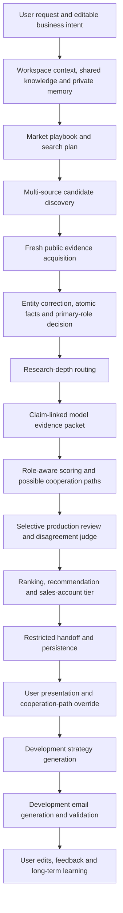

# Cudy 销售线索端到端工作流 v3.9.1

> 本文档由 `scripts/generate-lead-workflow-doc.mjs` 自动生成。请修改版本化配置或实现代码，不要直接编辑生成文件。

- 运行时策略版本：3.9.1（基础流程定义 2.13.0）
- 评分策略版本：2.0.0
- 成本质量策略版本：3.0.7
- 配置指纹：`1c7e8f4e406e2ec914bfeda0471b7e92a5dfa4cd65dadc8921ed86cb69012c67`
- 范围：From the user's natural-language market-development request and workspace context to ranked companies, editable cooperation paths, development strategy, outreach email, and private-memory learning from user edits.

## 一、从用户输入到最终输出的总流程

最终输出不是单一分数，而是：证据约束下的公司身份与角色、评分、可能合作路径、账户等级、开发策略、开发信，以及用户修改后形成的私有长期学习信号。

## 二、不可破坏的核心原则

- The original search channel is provenance only and never determines the final primary role or cooperation path.
- Only current-run or freshness-validated evidence may affect scoring.
- Unknown evidence is not negative evidence.
- Product and use-case fit is evaluated against the best enabled Cudy product track and the candidate role's actual target customers.
- User-confirmed knowledge has higher priority than ordinary retrieval, while shared knowledge and user/workspace memory remain isolated.
- Cooperation paths, roles and evidence restrictions travel into development strategy and email generation.
- User edits to paths and outreach are retained as private learning signals, not written into the shared knowledge base.
- OpenAI and Anthropic generation is routed through the pinned OpenRouter HTTPS gateway. DeepSeek keeps its dedicated provider as primary; public-only packets first try the same DeepSeek tier through OpenRouter and then an OpenAI same-capability peer with an independent route deadline, while embeddings never fail over.
- Every potentially overlapping task must create and consume a versioned cache at first execution; downstream stages receive exact evidence IDs, role corrections and explicit missing-evidence gaps.
- Search localization is keyed by market country, provider-owned result pages are provenance rather than candidate domains, and a primary role must be concrete unless two or more role families are genuinely co-primary.
- Only evidence deterministically affiliated with the candidate entity may enter correction or scoring, and target-country eligibility must be corroborated by the correction-stage country finding.
- Explicit third-party marketplaces are not Retailer/E-tailer prospects; unknown scale receives a neutral nonzero cap, and buying influence cannot exceed the deterministic evidence cap.
- Configured SearchAPI-dependent Reseller and Retail tracks use Gemini Full only after observed provider unavailability; the backup is skipped at zero cost while SearchAPI is healthy.
- Search extension preloads all same-task discovered, rejected, enriched and corrected domains; a cached entity cannot re-enter paid gating, evidence, correction or scoring.

## 三、模型调用路由

| 阶段 | 用途 | 默认模型 | 升级/回退 | 调用策略 |
|---|---|---|---|---|
| `01-user-input` | Intent classification and execution planning | KIMI_INTENT_LIGHT_MODEL; default kimi-k2.6 | KIMI_INTENT_MODEL or KIMI_MODEL; default kimi-k3 for materially complex planning | Light Kimi runs every turn; deterministic parsing is failure fallback only; harmless confidence/count formatting is normalized before schema validation |
| `02-context-memory` | Local-database RAG query and memory embeddings | EMBEDDING_MODEL; default text-embedding-v4 | No generative fallback | Required for vector retrieval; source documents remain in the local database |
| `03-playbook` | Market playbook and search-query planning | LEAD_PLANNER_MODEL or OPENAI_GENERATION_MODEL; default openai/gpt-5-mini through OpenRouter | Deterministic playbook with required role-family coverage | Cached standard playbook; light Kimi checks template fit; complex non-standard tasks use Kimi-k3 planning |
| `04-discovery` | Lightweight candidate existence, relevance and category gate | DEEPSEEK_DISCOVERY_GATE_MODEL; fixed default deepseek-v4-flash and never inherits a Pro global routine setting | At most two public-only equivalent fallbacks: the same DeepSeek tier through OpenRouter, then openai/gpt-4o-mini; unavailable batches are held for downstream evidence, never upgraded to Pro | Batches of up to 10 after direct lightweight homepage fetch; compact semantic signals only, with deterministic pass/hold/reject; optional reasoning is disabled on the OpenRouter same-tier route |
| `06-correction-role` | Entity correction, atomic facts and primary-role analysis | DEEPSEEK_MODEL; default deepseek-v4-flash | DEEPSEEK_ESCALATION_MODEL; default deepseek-v4-pro for policy-qualified semantic escalation; provider recovery uses public-only same-tier OpenRouter then openai/gpt-4o-mini, while deterministic fallback is retry-only | Relevance-prioritized compact evidence packets and token-aware routine batches; each automatic fallback has an independent deadline; optional reasoning is disabled for OpenRouter DeepSeek; malformed output permits one same-tier single-candidate repair; infrastructure failure never upgrades to Pro; supported third-party-marketplace findings deterministically remove Retail/E-tail roles; Pro requires a valid routine prediction of score change >=8 or a resolvable critical-state change |
| `09-scoring-paths` | Role-aware score and possible cooperation paths | DEEPSEEK_MODEL; default deepseek-v4-flash | DEEPSEEK_ESCALATION_MODEL; default deepseek-v4-pro for policy-qualified semantic escalation; provider recovery uses public-only same-tier OpenRouter then openai/gpt-4o-mini | Routine batches with independent fallback deadlines and optional reasoning disabled for OpenRouter DeepSeek; malformed output permits one same-tier single-candidate repair; infrastructure failure never upgrades to Pro; unknown scale is capped at neutral 8/15 and cooperation influence is evidence-capped; confidence, alternative paths and Top-N position never trigger upgrade alone |
| `10-review` | Selective production secondary review and disagreement judgment | LEAD_REVIEW_MODEL default openai/gpt-5.6-terra; LEAD_JUDGE_MODEL default openai/gpt-5.6-sol through OpenRouter | DeepSeek review adapter using deepseek-v4-pro when explicitly routed | Selective only; this production control is distinct from the two-judge offline formal-evaluation calibration |
| `offline-blind-calibration` | Formal search-evaluation calibration after both experiment arms and shared scoring are frozen | Two different high-capability provider/model families; current protocol pins Anthropic Claude Opus and OpenAI GPT-5.6-sol | A third high-capability arbitrator only for score delta >=8, role-family disagreement or critical qualification disagreement | No Web search; 48 representative cases control gates and 16 stress cases are diagnostic only; reuse frozen score-independent evidence packets |
| `14-strategy` | Path-specific development strategy | KIMI_OUTREACH_MODEL or KIMI_MODEL; default kimi-k3 | Restricted template fallback | One call per generated strategy |
| `15-email` | Path-specific development email | KIMI_OUTREACH_MODEL or KIMI_MODEL; default kimi-k3 | Restricted template fallback | One call per generated email, plus one bounded retry only for invalid JSON/schema output |
| `16-feedback-memory` | User-feedback revision and reusable private-memory extraction | CLAUDE_OUTREACH_MODEL or CLAUDE_MODEL; default anthropic/claude-sonnet-4.6 through OpenRouter | Keep the user draft and record a failed memory event | One call per requested revision; text-embedding-v4 embeds accepted private memory |

无生成模型阶段：多源搜索与网页抓取、研究深度确定性规则、证据包压缩、新鲜度校验、排行榜、账户等级、handoff 组装和持久化。

意图识别每轮先调用轻量 Kimi 检查标准模板是否足够；仅在多市场、多目标、冲突约束或非标准复杂规划时升级 Kimi-k3。Lead 纠偏和评分以当前 DeepSeek 模型为主，只有预计改变总分至少 8 分或关键状态且高能力模型可解决时升级。主模型与升级模型相同则合并调用。最多允许两个显式批准、同级能力、同 Schema、同数据权限的跨公司 fallback；Embedding 不设置 fallback。

## 四、逐步输入、输出与策略

## 离线正式测评治理

- 盲审协议：`experiments/search-e2e-evaluation/uk-mx-v1/config/blind-audit-v2.0.0.json`
- 适用范围：Offline calibration of a frozen formal search evaluation; it does not add two judges to every production lead.
- 抽样：Six score/rank/arm-independent representative candidates plus two diagnostic stress candidates per cell; only the representative cohort controls pass/fail.
- 评审：Two independent high-capability provider/model families. A third decision runs only when total scores differ by at least eight points, role families disagree, or identity/market/request-family/score-threshold/eligibility states disagree.
- 证据：Packets reuse current-run cached evidence selected independently of scorer citations and include a same-market/same-role scale anchor. They hide arm, provider, rank, score, eligibility, cohort and stratum.
- 指标：Role-family agreement is the main role gate; exact subtype is diagnostic. Qualification is decomposed into identity, market, requested family, score threshold and output eligibility. Citation ID validity and claim entailment are reported separately, with per-cell macro Spearman as the ranking gate and raw inter-judge agreement retained as a stability diagnostic.
- 成本控制：No new search or evidence acquisition. Every judge output is consumed by consensus, arbitration is conditional, every cache miss requires atomic budget authorization, and judge/arbitrator token cost, latency, retries, discarded outputs and downstream use are recorded separately.
- 历史边界：The completed v1.1.6 blind result remains immutable and is not recalculated under v2.

### 1. User request and editable business intent

阶段 ID：`01-user-input`

输入：

- Natural-language request
- Target country/market
- Desired count
- Optional roles, products, constraints and nominated companies

输出：

- LeadSearchPlan
- Explicit opportunity targets
- Coverage mode
- Verified-only flag
- Kimi requested/actual model, success state, usage availability and token/latency/retry usage
- userId
- workspaceId
- actionId
- graphThreadId

策略：

- Preserve explicit user constraints
- Treat requested roles as search intent, not final classification
- Agent, Brand Owner and OEM/ODM are explicit-only; explicit English, Spanish or Chinese exclusions override keyword mentions
- Never route OEM/ODM supplier sourcing
- Mark nominated companies for deep research
- Record the light Kimi call and any K3 escalation separately instead of attributing only the final model
- Normalize non-critical objective and coverage-mode synonyms deterministically; unknown coverage mode uses the existing auto default
- Normalize numeric strings, percentages and bounded descriptive confidence without replacing Kimi semantic intent; nonnumeric target counts fall back to the user-request parser
- For frozen evaluations, require the recognized roles to stay inside the requested category, then execute the complete frozen role set
- Preserve failed-call telemetry before deterministic fallback; formal evaluations reserve budget when provider usage is unavailable

失败与回退：Reject only structurally unusable requests; do not silently invent a target market or role, and do not discard paid-call telemetry when falling back.

流向下游：

- Knowledge retrieval
- Workflow checkpoint identity

### 2. Workspace context, shared knowledge and private memory

阶段 ID：`02-context-memory`

输入：

- LeadSearchPlan
- Shared product/company/industry RAG
- User-confirmed workspace knowledge
- Private cooperation-path memory
- Private email-style and edit memory

输出：

- LeadRagCitation[]
- Embedding request/token/latency usage
- CooperationPathMemory[]
- OutreachKnowledge[]

策略：

- Keep shared and private stores physically/logically separated
- Give user-confirmed knowledge priority over ordinary retrieval
- Never let private edits contaminate the shared Cudy knowledge base

失败与回退：Pre-search gate blocks lead discovery when required product, company or industry context is missing or uncorroborated.

流向下游：

- Market playbook
- Path recommendation
- Development strategy
- Email style

### 3. Market playbook and search plan

阶段 ID：`03-playbook`

输入：

- LeadSearchPlan
- RAG citations
- Private cooperation-path memory

输出：

- Market hypothesis
- Enabled product angles
- Preferred traits
- Exclusions
- Role-family search queries

策略：

- Use confirmed Cudy positioning and competitors
- Do not average all product families
- Keep original role lanes only as discovery coverage
- Use the versioned active category route; the playbook supplies market language and product focus without duplicating provider planning

失败与回退：Use a deterministic playbook fallback with warnings when the model cannot return a valid plan.

流向下游：

- Candidate discovery
- Qualification context

### 4. Multi-source candidate discovery

阶段 ID：`04-discovery`

输入：

- Market playbook
- Role-family queries
- Target count
- Active hybrid-search policy

输出：

- Raw candidate names/domains
- Discovery provider and lane provenance
- Initial URLs/snippets
- Light-gate pass/hold/reject
- Call fingerprint and query-cluster key
- Per-call request, grounding-query, cache, yield, cost, latency, retry, failure-class and discard telemetry

策略：

- Run the confirmed category-specific provider tracks with shared real-time deduplication
- Use DeepSeek Flash only for a compact lightweight gate after direct homepage text; never upgrade this gate to Pro
- Test each requested category by its defining commercial action before paid evidence: reject directories, direct brand stores without an independent multi-brand retail operation, non-retail ISPs, and category-irrelevant general retailers
- Treat a requested count as final valid in-role companies and feed evidence/role outcomes back into dynamic search rounds
- Plan the first candidate buffer at 1.5 times the requested count, then adapt from conservative observed end-to-end yield
- Start national retail, E-tail and Google Places local retail together in configured low-SEO markets
- Use local-language commercial terminology and query clusters; expand mature markets to local coverage only after a measured gap
- Stop a track only after two completed no-value batches; provider failures never count as no-value
- After two transient failures from one provider, skip the next discovery round and run a bounded recovery probe in the following round
- Use Gemini Full only as the configured provider-gap backup for SearchAPI-dependent Reseller and Retail tracks after an observed SearchAPI failure, circuit or cooldown; skip it without a provider call while SearchAPI is healthy
- Serialize calls sharing one provider while different provider mechanisms remain concurrent, so exclusions update before the next same-provider query
- Tavily is forbidden in candidate discovery and remains evidence-only
- Gemini Product is not a default Retail or Reseller route
- Provider score and rank cannot enter final value scoring
- Strip result punctuation, validate DNS labels, reject public-suffix-only identities, canonicalize registrable domains and retain first, duplicate and assisted discovery provenance

失败与回退：Classify authentication, quota, rate-limit, timeout, transport, HTTP, invalid-response and configuration failures. Non-transient failures open a scoped circuit; bounded same-tier complementary alternatives continue. Failed calls are cached briefly but never counted as empty successful searches. A gate-model failure holds candidates for evidence instead of inventing rejection or escalating capability.

流向下游：

- Fresh evidence acquisition

### 5. Fresh public evidence acquisition

阶段 ID：`05-evidence`

输入：

- Passed or held discovered candidates
- Official-site and targeted public search queries
- Evidence freshness policy

输出：

- Immutable evidence snapshot
- capturedAt
- contentHash
- sourceType
- freshnessStatus
- evidenceRunId
- Explicit missing-evidence list
- Tavily search/extract credits, attempts, retries and latency

策略：

- Reuse current public-evidence-library material before spending search credits
- Cold-start evaluation mode can explicitly disable both historical evidence reads and evidence-library writes while preserving within-run cache and deduplication
- Old-run evidence is discovery-only until reacquired or validated
- Use Tavily only for targeted evidence discovery/extraction, not candidate discovery
- Prefer official and independent public sources
- Search for defining business actions, product tracks, target customers, size and cooperation signals
- Pass exact evidence IDs and missing gaps downstream; a later Agent may supplement only a material unresolved gap

失败与回退：Failed retrieval becomes unknown; it never becomes a negative fact. Attempts, retries and latency from a failed Tavily request remain in stage telemetry rather than being reset to zero.

流向下游：

- Entity correction
- Role classification
- Freshness audit

### 6. Entity correction, atomic facts and primary-role decision

阶段 ID：`06-correction-role`

输入：

- Fresh evidence snapshot
- Submitted candidate identity and discovery roles
- Exact evidence IDs
- Explicit missing-evidence list

输出：

- Corrected company/domain
- Atomic fact ledger
- All supported roles
- Primary role or Hybrid/Unresolved
- Correction confidence
- Versioned public role-correction cache entry

策略：

- Reuse an exact evidence/prompt/taxonomy role-correction cache hit before any model call
- No upward-priority rule
- Agent independently decides the primary business role
- Hybrid requires evidence that distinct role families are material co-primary operations; multiple supported roles alone are insufficient
- Duplicate merging never invents Hybrid when Agent decisions conflict; it preserves Unresolved for later review
- Distributor requires evidence of supplying downstream channel partners
- VAD, E-tailer, Retailer and VAR use explicit subtype business-action boundaries
- A company may hold multiple supported roles
- Truncate oversized text and remove unknown enum labels before schema validation without upgrading or inventing business claims
- Keep public role-correction knowledge separate from private user/workspace memory

失败与回退：Ambiguity escalates to the high-capability model; deterministic fallback is retry-only and not externally publishable as a resolved identity.

流向下游：

- Research depth
- Role-aware scoring
- Cooperation paths

### 7. Research-depth routing

阶段 ID：`07-research-depth`

输入：

- Corrected role
- Positive size evidence
- Product relevance
- User nomination
- Conflicts

输出：

- deep
- standard
- limited

策略：

- Deep research for global/national/valuable or nominated companies
- Standard research for ordinary viable candidates
- Limited research only for positively identified long-tail candidates
- Sparse web presence alone does not prove small size

失败与回退：Long-tail candidates may be held after targeted searches fail; strategic companies must not be downgraded merely because their channel structure is complex.

流向下游：

- Evidence budget
- Model routing
- Search stopping rule

### 8. Claim-linked model evidence packet

阶段 ID：`08-evidence-packet`

输入：

- Current evidence
- Atomic findings
- Cost-quality policy

输出：

- All finding-linked evidence
- Small relevance-ranked context set
- Compacted excerpts

策略：

- Never remove evidence referenced by a finding
- Remove stale/discovery-only material
- Deduplicate unlinked context
- Keep keyword windows for products, roles, customers, scale and procurement

失败与回退：If compaction cannot retain every cited evidence ID, stop rather than score with an incomplete fact ledger.

流向下游：

- Primary scoring
- Independent review

### 9. Role-aware scoring and possible cooperation paths

阶段 ID：`09-scoring-paths`

输入：

- Corrected candidate
- Atomic findings
- Evidence packet
- Cudy playbook
- Private path memory
- Versioned scoring policy

输出：

- Seven dimensions
- Total score
- Eligibility
- Score confidence
- At most two compact possible paths in normal product mode
- Selected path in normal product mode

策略：

- Product/use-case fit 50
- Path/influence 15
- Same-primary-role scale 15
- Execution 10
- Opportunity/risk 10
- Use the best enabled product track
- Use role-specific target-customer and scenario criteria
- Normal product mode uses only the five-path taxonomy and computes path FitScore deterministically from 30/25/20/15/10 sub-scores
- Search-quality evaluation mode uses a score-only schema: score procurement/influence from role evidence and emit no paths, strategy, email or contacts
- Do not output path Confidence
- Unknown is not zero
- Path memory is guidance, not unsupported public fact

失败与回退：Unsupported evidence IDs and paths are removed; schema failures retry only the invalid candidate and reuse checkpoints.

流向下游：

- Independent review
- Ranking
- Development handoff

### 10. Selective production review and disagreement judge

阶段 ID：`10-review`

输入：

- Primary assessment
- Evidence packet
- Review-routing policy

输出：

- not-required
- secondary-confirmed
- judge-resolved
- targeted-research-required
- review-failed

策略：

- Review only severe deterministic conflicts and unresolved critical states
- Do not review solely for low confidence, alternative paths, generic warnings or Top-N position
- Do not spend high-capability review on non-actionable long-tail research holds
- Judge only outcome-sensitive disagreement of at least 8 points or a critical state
- Keep this online selective review separate from formal offline blind calibration; the latter uses two independent judges and conditional arbitration on a frozen sample

失败与回退：Retain a valid primary assessment when review service fails unless a severe unresolved trigger makes publication unsafe.

流向下游：

- Final assessment
- Research queue
- Cost telemetry

### 11. Ranking, recommendation and sales-account tier

阶段 ID：`11-ranking-account`

输入：

- Reviewed assessments
- Primary roles
- Eligibility
- Configurable thresholds

输出：

- Ranked companies
- Recommendation priority
- Sales account tier

策略：

- Account tier does not alter score
- KA is only for downstream candidates
- Tier-1 distributors use Strategic/Priority/Standard/Long-tail Distributor
- Scale is compared within the same primary role

失败与回退：Any tier-1 Distributor/VAD assigned KA fails the deterministic quality gate.

流向下游：

- User results
- Sales workspace
- Handoff

### 12. Restricted handoff and persistence

阶段 ID：`12-handoff-persist`

输入：

- Corrected candidate
- Final assessment
- Review
- Evidence ledger

输出：

- LeadDevelopmentHandoff
- Externally usable facts
- Internal interpretations
- Do-not-claim list
- Personalization hooks
- Quality flags

策略：

- Keep handoff within transport budget
- Only supported facts may be used externally
- Carry role and at most two possible paths to downstream agents
- Anchor downstream execution to selectedPathId unless the user overrides it

失败与回退：Email generation is disabled when the handoff is not ready for external use; strategy may still be generated with unknowns.

流向下游：

- Sales UI
- Development strategy Agent
- Email Agent

### 13. User presentation and cooperation-path override

阶段 ID：`13-user-result-edit`

输入：

- Ranked results
- Evidence-linked reasons
- Possible paths
- Selected path

输出：

- User-visible company assessment
- Optional selectedPathId override
- Owner/next action updates

策略：

- Show the Agent recommendation but allow the user to change the cooperation path
- Preserve who changed what and when
- Do not rewrite public evidence when the user changes a commercial preference

失败与回退：Reject a selectedPathId that is not one of the candidate's generated paths.

流向下游：

- Private path memory
- Development strategy
- Email

### 14. Development strategy generation

阶段 ID：`14-strategy`

输入：

- Full restricted handoff
- Selected cooperation path
- Role
- Risks
- Unknowns
- Private path memory
- Outreach knowledge

输出：

- Positioning angle
- Stakeholder sequence
- Value proposition
- Objection handling
- CTA strategy

策略：

- Evaluate all viable paths
- Anchor to the selected path
- Use different strategy for distributor, downstream channel, retail, operator and project/specification routes
- Keep unsupported claims internal or explicitly unknown

失败与回退：Fallback strategy remains inside the same handoff fact boundary.

流向下游：

- Development email Agent

### 15. Development email generation and validation

阶段 ID：`15-email`

输入：

- Development strategy
- Selected path
- Allowed lead facts
- Target contact
- Private email-style preferences

输出：

- Subject options
- Email body
- Evidence markers
- Generation metrics

策略：

- Use path-specific templates and CTA
- Every target-company factual sentence must stay inside the allowed-fact boundary
- Use approved style memory without copying unsupported company claims

失败与回退：Invented evidence IDs, missing required markers or use of do-not-claim facts rejects the draft and triggers bounded revision/fallback.

流向下游：

- User review
- Draft persistence
- Sending workflow

### 16. User edits, feedback and long-term learning

阶段 ID：`16-feedback-memory`

输入：

- Manual email edits
- Feedback instruction
- Path override
- Approved final draft

输出：

- Outreach edit events
- Email-style preference memory
- Cooperation-path preference memory
- Audit trail

策略：

- Store only valuable reusable preferences
- Scope memory to user/workspace
- User-confirmed marketing phrasing may be reused as approved messaging but does not become public scoring evidence
- Never write private memory into shared RAG

失败与回退：Memory extraction failure does not block saving the user's draft; it records a failed memory event for retry.

流向下游：

- Future playbooks
- Future path recommendations
- Future strategy and email generation

## 五、当前评分标准

| 一级维度 | 分值 | 细分规则 |
|---|---:|---|
| 产品与应用场景匹配 | 50 | 产品家族 25；客户与场景 15；定位兼容 10 |
| 合作路径与采购影响力 | 15 | 当前路径 5；采购控制 6；选择/市场影响 4 |
| 同主角色规模与覆盖 | 15 | 相关业务规模 6；市场覆盖 5；渠道/客户网络 4 |
| 执行与赋能 | 10 | 商业运营 4；技术服务 3；市场激活 3 |
| 机会与风险 | 10 | 合作开放度 4；时机 3；竞争与结构风险 3 |

产品匹配方法：`best-enabled-track`；未知证据规则：`unknown-not-zero`。规模只在相同主角色内横向比较。

## 六、成本控制参数

- 优化目标：模型 token 再降 40%，付费搜索/提取额度至少降 30%。
- 证据预算：Limited 2250、Standard 5500、Deep 8000 tokens。
- 二次引用：预计改变总分至少 8 分或改变关键状态；仅提高少量置信度不允许。
- 主评分证据包：保留全部 finding 引用，另加最多 2 条上下文；单条摘录最多 1000 字符。
- 主评分批次：最多 42000 个序列化输入字符，同时仍受单批公司数上限约束；超限自动拆批，单候选不可再拆时保留为独立批次。
- 独立复核证据包：保留全部 finding 引用，另加最多 1 条上下文；单条摘录最多 800 字符。
- 路径最多 2 条；通常显示 FitScore ≥65，全部低于门槛时只显示最高一条；不输出路径 Confidence。
- Judge 总分差阈值：8。
- 随机盲审比例：0%。
- JSON Schema 只在最高优先级 system prompt 中发送一次，避免在 user prompt 重复整份结构定义。
- 高并发只降低墙钟时间，不降低 token；真正的成本控制来自证据压缩、选择性复核、模型路由、缓存和单候选重试。
- 标准 playbook 与已完成评分使用租户隔离的精确依赖缓存；全命中时不得发送空模型请求。证据内容/新鲜度、纠正事实、评分策略校验和、Prompt、任务目标或用户路径记忆变化时，仅重算受影响候选。

## 七、质量门禁

- strategicCandidateRecallPercent: 100
- primaryRoleAgreementPercent: 97
- eligibilityAgreementPercent: 97
- offlineToolTopNOverlapPercent: 90
- maximumMeanAbsoluteScoreDifference: 3
- tier1DistributorKaErrors: 0
- invalidEvidenceUsedForScoring: 0
- validEvidenceReferencePercent: 100
- privateMemoryLeakage: 0
- maximumTokenIncreasePercent: 5
- targetTokenReductionPercent: 40
- targetPaidSearchCreditReductionPercent: 30

任何成本优化必须在同一冻结证据快照上通过这些门禁，未通过时自动回退完整证据或高能力路径。
正式产品不以 Top-N 作为升级依据；Top-N ≥90% 只用于离线搜索工具排行榜。代表性 A/B 每类只选 1–2 家，MAD 上限为 3 分，不自动全量重跑 207 家。

## 八、离线工具搜索结果评测模式

- 工具排行榜只消费冻结的搜索结果与证据快照，不追加搜索、不补充证据，也不生成合作路径、开发策略或开发信。
- 模型只输出主角色、门禁语义判断、七项语义子分和精简证据说明；总分、状态归一化、工具映射与榜单聚合均由程序确定性完成。
- 同一规范化公司只评分一次，再把结果映射回各搜索工具的候选出现记录，避免跨工具重复消耗模型 token。
- 固定角色赛道容量、缺位记零及 Top-N 保留率只用于离线工具质量比较，不得成为正式产品的搜索停止、模型升级或候选淘汰依据。
- 每次评测保存冻结输入指纹、禁止调用项、实际模型、token、请求次数、重试、有效输出、下游采用率和丢弃原因；发布前由程序清理无效证据引用并执行完整性门禁。

## 九、搜索、网页与 PDF 获取策略

- 已知官网 URL：先定向 Extract；Search 用于发现 URL，Extract/解析器用于读取正文，模型只看与当前缺口相关的片段。
- Limited：Basic + raw content，最多 1 个查询组，不重复 Extract。Standard：Basic 不带 raw，提取 2–4 页。Deep：最多 3 个查询组，仅在实体冲突、复杂集团或 Basic 失败时用 Advanced；Crawl 仅限复杂站点且有边界。
- PDF 先做价值门禁：≥60 才提取，45–59 只抽样，低于 45 跳过；每次升级提取方式前重新评估价值。
- PDF 默认 pypdf；表格转 pdfplumber；扫描件仅对选定页用 Tesseract；仍有关键缺口时才对选定页使用高能力多模态模型。

## 十、五类合作路径与流向

- Direct Tier-1 Supply
- Distributor-Mediated Supply
- Direct Downstream Channel Supply
- OEM/ODM
- Other

路径 FitScore 由模型给出五个语义子分、程序求和：角色/结构 30，用户阶段/供货 25，产品/客户/场景 20，采购/影响 15，执行可行性 10。角色与路径展示给用户且可修改；修改写入私有长期记忆，并与识别角色、候选路径一起输入后续开发策略和开发信 Agent。

## 十一、知识、证据与长期记忆边界

| 数据 | 存储范围 | 可影响评分 | 可影响策略/邮件 |
|---|---|---:|---:|
| Cudy 产品、场景、客户与竞品确认知识 | 共享知识库 | 是 | 是 |
| 普通 Web/RAG 证据 | 独立 public_evidence 库及版本化快照 | 是；陈旧只提醒，不自动 invalid | 是，须在 handoff 允许范围内 |
| 用户确认的工作区知识 | 用户/工作区私有库 | 按知识策略；营销措辞不作为公共事实 | 是 |
| 用户合作路径修改 | 用户/工作区私有路径记忆 | 不直接改历史分数 | 是，影响未来路径推荐 |
| 用户开发信修改 | 用户/工作区私有邮件风格记忆 | 否 | 是 |

## 十二、成本与产出利用率遥测

每个阶段记录输入/输出数量与字节、生成/有效/下游采用量、Token、实际模型、fallback、搜索额度和依赖指纹。事件生命周期为 generated、valid、retrieved、cited、decision-used、displayed、selected、edited、executed。系统只自动记录优化机会，不自动应用；私有正文、Prompt 和供应商原始响应不进入 GitHub 文档或聚合遥测。

## 十三、实现文件指纹

以下指纹用于审阅代码是否发生变化。GitHub 自动同步任务会在相关实现或配置修改后重新生成本文档。

| 文件 | SHA-256 |
|---|---|
| `config/lead-scoring/policy-v2.0.0.json` | `0039203aafb29ec73e4beb10f72dc5ec114785fb4c5f311c7b425de0d451fc1b` |
| `config/lead-search/hybrid-search-v1.0.0.json` | `d23b959ee605c20041cf4de4d3ad742577edd4e23289bf4e9691e7f14296f52b` |
| `config/lead-workflow/cost-quality-policy-v3.0.0.json` | `24bf881bff19bfd053d1c58ab127b62aeee17785b1fe7cdf86b478ed59516c59` |
| `config/lead-workflow/runtime-policy-v3.0.0.json` | `38a184c9c01db605402b3d279c1e50f72b1cf61953f0fd71aae191dd0bcb154d` |
| `src/app/api/assistant/messages/route.ts` | `04bec90cc3d3f336195e8ab97a5ad4b1ec1e05b95606064225e098e94ed7a5cd` |
| `src/lib/assistant/types.ts` | `652b9c0f6b7a0a27d505f0fe35aa93561e824430aedb96473e7040ee63069621` |
| `src/lib/assistant/intent.ts` | `cb77a2854f0058d92bf758ce4610d298bc94dde0157ade4f0bd3d05343fad168` |
| `src/lib/assistant/intent-agent.ts` | `4b1e05ac12bc9017cf707cb69af18a15f3331234e73bbaae007b607756a1b901` |
| `src/lib/rag/openai-provider.ts` | `fa55855ea611c744e41d1b297a968a841d965d4fadb5447f17a0c2e4d5a18c10` |
| `src/lib/assistant/service.ts` | `68ff8e65e30bf22f45859cf05c828336e661a31a2143e25c3a9a1d246f36d3c0` |
| `src/lib/assistant/repository.ts` | `5f8a96b484418bc47dc119e5ceb7b7989f0f551915bfd3b9e8068b013bca001b` |
| `src/lib/leads/workflow/graph.ts` | `82da74c3a1c23e3a3c7bbea00dd4b8090171865485b93165accdebff03d4530f` |
| `src/lib/leads/workflow/jobs.ts` | `571596be71410650544716b4acd26e3e3cc84aa176ab1b057a13e66bd452d81a` |
| `src/lib/leads/workflow/rag-context.ts` | `1b69116673651732bf41409364861d54715ea5889d874c43ec29852e770d323e` |
| `src/lib/leads/workflow/playbook.ts` | `0641f1e0715dcb13a0c94bbd002d4c17d9eca2a4f6e62200f8bc939f44ab359c` |
| `src/lib/leads/workflow/playbook-cache.ts` | `2c16be23aa54888be27e6483e2634fa763b07be7bce551bb9199c4d55c66cfa0` |
| `src/lib/leads/workflow/hybrid-search-policy.ts` | `4daeb4a5712dbf6e57e3f036f2e7be7970edf86fcd5299ebfcc6febcb78d7e73` |
| `src/lib/leads/workflow/candidate-registry.ts` | `f2d98cbce22ad02207047d782a12fe1fac98f5c1852e9f09df6525f4a71692e0` |
| `src/lib/leads/workflow/discovery-gate.ts` | `8f58856e95fef505866759afe9d9b5e296702ed47ece79893652e3859cb49c19` |
| `src/lib/leads/workflow/hybrid-discovery-executor.ts` | `a9e8d62eed2c7c17f876210a2aecfa25a7e3ad67f785b7635f328b13892a3ba4` |
| `src/lib/leads/workflow/discovery.ts` | `0353c3cf73ed400db5e7a7c541b4093f2828845237f4857f63c15e1692701200` |
| `src/lib/leads/global-search.ts` | `093fa84358d01107625fb2d50d56b30869b3f528dad4864680b2c66275955a07` |
| `src/lib/leads/workflow/evidence-correction-agent.ts` | `f09658cedf9234a7dfa91d5192388bcbe18e5892c073606247f26b6d0d6607bf` |
| `src/lib/leads/workflow/evidence-packet.ts` | `8192c83a87eada51e9be0e5f4af3888d2c520d9a977552e5a8b01f37aa037604` |
| `src/lib/leads/workflow/qualification-agent.ts` | `bd19b825276823e64f945b4e0e602b885cf2a43a45a7666da1a9cf78278bf7d6` |
| `src/lib/leads/workflow/assessment-cache.ts` | `fd85ce372411429490cd1f272575f337a91a543bdd2b0c06cb04c362842c4df4` |
| `src/lib/leads/workflow/assessment-review-agent.ts` | `e4ab294e1641670bfae34778fe3ce81d46c838994751f86b891a4ce750095564` |
| `src/providers/deepseek.ts` | `1854d05d89a8a6717d730119249782c1ddb9243c0789f787619b032b6237c6f5` |
| `src/providers/discovery-contracts.ts` | `a9238f7099d848f6abb0b6b6fca824afaceba6fc5fa0d29e384345274aca4cc0` |
| `src/providers/discovery.ts` | `acb27469ea9c27bc6f24dff56160b8d4b26dedfff84bb386390c6a8dcc21fc2f` |
| `src/providers/resilient-ai.ts` | `f56ca8b73891f37b8e20a5c604360a318aee951a8c486afa65e98b9d37534fd7` |
| `src/providers/openrouter.ts` | `b43ba8fdf08602cb7d3567ea88bdc2cfee704de0c1b197cc574abe5e9b89143d` |
| `db/migrations/034_model_account_cash_cost.sql` | `4790c7ad12eda543e197c84ddd77c4a5ce296b7871ccee799f3aa2262684bdbb` |
| `src/providers/tavily.ts` | `b02257f8499a16b370ca42493e45bbbf53b7214b9f803203ab5e19ef80969eda` |
| `src/lib/leads/workflow/handoff-assembler.ts` | `9ae8b6c648adad072f934a4fe360d74222ebb604340a1bb96546167d4a621567` |
| `src/lib/leads/workflow/persistence.ts` | `ea2b7fab0acd3fda816bd520b527d44e96aedab0af86479e30ce07c9f8f5e1db` |
| `src/lib/sales/repository.ts` | `87900b1507a183d6bf3b9a184a63ce09cf49e2272f813117e8519b321365689a` |
| `src/lib/outreach/graph.ts` | `47a6fc1d1d634c603f5a429a810f9cd97ff14483694dad76e0b368bf849cb4d2` |
| `src/lib/outreach/kimi-agent.ts` | `7e4b1dabd294294702bdb0c20c653b60741462527aa941db3299b7df4c3b7540` |
| `src/lib/outreach/claude-agent.ts` | `4866ce8accb25a24540fb927e617808c4508eaf469ce7936990ac51497955a20` |
| `src/lib/outreach/repository.ts` | `dde25c7433a4b24314827e9ca5f41427bacc359af081a5d366b7da806e051c3b` |
| `src/lib/outreach/knowledge-repository.ts` | `06fae134c522715a8f2b076317a3d74c1935d515c16eed5612b4122f4e9aaf5e` |
| `db/migrations/033_hybrid_search_contribution.sql` | `6e002fe0a49bddd75853b6d13fdc5759b9f4b90653ffda47ccc6c8f4fddbb0d0` |
| `experiments/search-e2e-evaluation/uk-mx-v1/lib/cost-ledger.ts` | `111c94e229c1ec899b1049dda41279b01be4b86e06bfa99d3c18750ba1459291` |
| `experiments/search-e2e-evaluation/uk-mx-v1/lib/blind-audit-v2.ts` | `5277866771bcc47ed868ba13f816bbbd58ed5f6723328da6111afd17fc9ad878` |
| `experiments/search-e2e-evaluation/uk-mx-v1/lib/provider-clients.ts` | `13f324ff47b80bb1c1bbe6c03e45cbc7b5acb3c99d67f4028938a0732191f1d1` |
| `experiments/search-e2e-evaluation/uk-mx-v1/lib/runtime-schemas.ts` | `72c4514c9af39a64ac0780bfe3346bc0ee3fe0fb2ff65f8eb0a789526e20cc34` |
| `experiments/search-e2e-evaluation/uk-mx-v1/lib/product-cell.ts` | `48fd5b76964dfe40fd861db0eac868317b407e87a7d56dbe93f235dea84e033f` |
| `experiments/search-e2e-evaluation/uk-mx-v1/lib/unified-evaluation.ts` | `c38226403804269633e5dc8987caf490b40331070cdc27e2fd0151cd2de10fe5` |
| `experiments/search-e2e-evaluation/uk-mx-v1/config/blind-audit-v2.0.0.json` | `b3a49d39300542f2a4ca22fd7c463a314054f9c7e113c87c73830b7cd44eca50` |
| `experiments/search-e2e-evaluation/uk-mx-v1/config/blind-judge-rubric-v2.md` | `12ecf56002cb4ae94b5ce36e668791511cb4c6733ef3e25dd0e709bc5335611b` |
| `experiments/search-e2e-evaluation/uk-mx-v1/config/blind-judge-arbitration-rubric-v2.md` | `9da86ada8d71641429c66190d080db994d9af3e364aa3c099d283e7ae038e42a` |
| `experiments/search-e2e-evaluation/uk-mx-v1/schemas/blind-judge-output-v2.schema.json` | `9b902804a6462764a935311abb8ef7a602705bf5b6dd8e3a26e13b7beda42350` |
| `experiments/search-e2e-evaluation/uk-mx-v1/scripts/run-formal-experiment.ts` | `b4d7c0254b51a6919e6885c602ac5debbd5dae64382fedd4ddf1df596ea940cd` |
| `src/lib/leads/workflow/evidence-budget.ts` | `db035da87b8896ae5a81b12744a072810de80f160cb472724d5cedbcf06037f9` |
| `src/lib/leads/workflow/pdf-extraction-policy.ts` | `6d8847827f1e96eab570114bca33cd447eaa3e64d7246ee09a748f8e6d6ade03` |
| `src/lib/leads/workflow/public-evidence-repository.ts` | `5dcbfe60487eeb5d2ccab4b6e3eac9529705b21005abaa599359c992e51c4b03` |
| `src/lib/leads/workflow/workflow-telemetry.ts` | `47c86d6b05cd87f088eb110cae2603989aebc920b4203688fb899c4d48cbde95` |
| `src/lib/leads/workflow/role-correction-cache.ts` | `d7923ad4a5f97f85ff79dd0cf79ab3b82642bf5be477157486a3be7ea0ec769f` |
| `src/lib/leads/workflow/target-completion-policy.ts` | `ea38251babbeb921f7c7857d9a743e1d410ac080f56804da6019181297b7f804` |
| `experiments/multi-source-lead-discovery/scripts/score-v3-tool-lead-value.ts` | `633e541c552fd9d979a60211fc4adf981327966a197d8439f41c3a88392bd6b8` |
| `experiments/multi-source-lead-discovery/scripts/render-v3-tool-evaluation.ts` | `1fdb0d23c3465159403b54f4a42a19e28556ce31de320c118ada5d8fd2615a7c` |
| `experiments/multi-source-lead-discovery/scripts/verify-v3-tool-evaluation.ts` | `447ed84f220192fbab192033ebde7d8b0b2f7d86552a0769cbe0f341d33797fd` |
| `db/migrations/029_isolated_user_long_term_memory.sql` | `e3564a7328ffd643e60798c4d2bd6377c563aec0c224ad54589f534a0b5ae07c` |
| `db/migrations/030_public_evidence_library.sql` | `43a795e0b015613db763707136829c04bdca56a0b6a19b950a9bf9a810eb3998` |
| `db/migrations/031_workflow_efficiency_telemetry.sql` | `982a799ecd008ba7f8b68d9fc6b54fc59f2532aad8dea4fb7771659badff0a26` |
| `db/migrations/032_lead_assessment_cache.sql` | `3837fd5de46961ebf27258f59ecfb623407e601dcd1e0554dcc64cab370acad6` |
| `db/migrations/035_search_and_role_correction_cache.sql` | `2b9d8caeef27c260e3a6a49aef32b2a514604c24e671a8833a9b486ccdd3dd78` |
