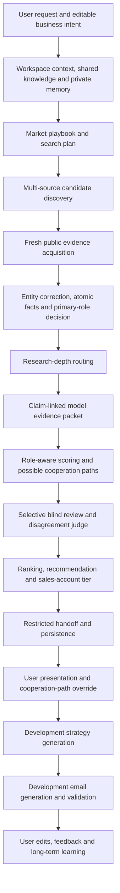

# Cudy 销售线索端到端工作流 v2.0

> 本文档由 `scripts/generate-lead-workflow-doc.mjs` 自动生成。请修改版本化配置或实现代码，不要直接编辑生成文件。

- 工作流版本：2.0.0
- 评分策略版本：2.0.0
- 成本质量策略版本：2.0.0
- 配置指纹：`e562ee61964373351aa0d5fd68f77d928a7bcb58eba6aea715168ca3e4f60048`
- 范围：From the user's natural-language market-development request and workspace context to ranked companies, editable cooperation paths, development strategy, outreach email, and private-memory learning from user edits.

## 一、从用户输入到最终输出的总流程

最终输出不是单一分数，而是：证据约束下的公司身份与角色、评分、可能合作路径、账户等级、开发策略、开发信，以及用户修改后形成的私有长期学习信号。

## 二、不可破坏的核心原则

- The original search channel is provenance only and never determines the final primary role or cooperation path.
- Only current-run or freshness-validated evidence may affect scoring.
- Unknown evidence is not negative evidence.
- Product and use-case fit is evaluated against the best enabled Cudy product track and the candidate role's actual target customers.
- User-confirmed knowledge has higher priority than ordinary retrieval, while shared knowledge and user/workspace memory remain isolated.
- Cooperation paths, roles and evidence restrictions travel into development strategy and email generation.
- User edits to paths and outreach are retained as private learning signals, not written into the shared knowledge base.

## 三、模型调用路由

| 阶段 | 用途 | 默认模型 | 升级/回退 | 调用策略 |
|---|---|---|---|---|
| `01-user-input` | Intent classification and execution planning | KIMI_INTENT_MODEL or KIMI_MODEL; default kimi-k3 | Deterministic intent parser | Conditional; skipped when credentials are absent |
| `02-context-memory` | Local-database RAG query and memory embeddings | EMBEDDING_MODEL; default text-embedding-v4 | No generative fallback | Required for vector retrieval; source documents remain in the local database |
| `03-playbook` | Market playbook and search-query planning | LEAD_PLANNER_MODEL or OPENAI_GENERATION_MODEL; default gpt-5-mini | Deterministic playbook with required role-family coverage | One structured call per lead-search run when configured; cacheable |
| `06-correction-role` | Entity correction, atomic facts and primary-role analysis | DEEPSEEK_MODEL; default deepseek-v4-flash | DEEPSEEK_ESCALATION_MODEL; default deepseek-v4-pro; deterministic fallback is retry-only | Routine batches; ambiguity, low confidence, warnings or invalid batch output escalate per candidate |
| `09-scoring-paths` | Role-aware score and possible cooperation paths | DEEPSEEK_MODEL; default deepseek-v4-flash | DEEPSEEK_ESCALATION_MODEL; default deepseek-v4-pro | Routine batches; conflicts, low confidence, omitted candidates or invalid output escalate per candidate |
| `10-review` | Blind secondary review and disagreement judgment | LEAD_REVIEW_MODEL default gpt-5.6-terra; LEAD_JUDGE_MODEL default gpt-5.6-sol | DeepSeek review adapter using deepseek-v4-pro when explicitly routed | Selective only; skipped for the search-tool leaderboard where cooperation-path review cannot affect the metric |
| `14-strategy` | Path-specific development strategy | KIMI_OUTREACH_MODEL or KIMI_MODEL; default kimi-k3 | Restricted template fallback | One call per generated strategy |
| `15-email` | Path-specific development email | KIMI_OUTREACH_MODEL or KIMI_MODEL; default kimi-k3 | Restricted template fallback | One call per generated email, plus one bounded retry only for invalid JSON/schema output |
| `16-feedback-memory` | User-feedback revision and reusable private-memory extraction | CLAUDE_OUTREACH_MODEL or CLAUDE_MODEL; default claude-sonnet-4-6 | Keep the user draft and record a failed memory event | One call per requested revision; text-embedding-v4 embeds accepted private memory |

无生成模型阶段：多源搜索与网页抓取、研究深度确定性规则、证据包压缩、新鲜度校验、排行榜、账户等级、handoff 组装和持久化。

## 四、逐步输入、输出与策略

### 1. User request and editable business intent

阶段 ID：`01-user-input`

输入：

- Natural-language request
- Target country/market
- Desired count
- Optional roles, products, constraints and nominated companies

输出：

- LeadSearchPlan
- userId
- workspaceId
- actionId
- graphThreadId

策略：

- Preserve explicit user constraints
- Treat requested roles as search intent, not final classification
- Mark nominated companies for deep research

失败与回退：Reject only structurally unusable requests; do not silently invent a target market or role.

流向下游：

- Knowledge retrieval
- Workflow checkpoint identity

### 2. Workspace context, shared knowledge and private memory

阶段 ID：`02-context-memory`

输入：

- LeadSearchPlan
- Shared product/company/industry RAG
- User-confirmed workspace knowledge
- Private cooperation-path memory
- Private email-style and edit memory

输出：

- LeadRagCitation[]
- CooperationPathMemory[]
- OutreachKnowledge[]

策略：

- Keep shared and private stores physically/logically separated
- Give user-confirmed knowledge priority over ordinary retrieval
- Never let private edits contaminate the shared Cudy knowledge base

失败与回退：Pre-search gate blocks lead discovery when required product, company or industry context is missing or uncorroborated.

流向下游：

- Market playbook
- Path recommendation
- Development strategy
- Email style

### 3. Market playbook and search plan

阶段 ID：`03-playbook`

输入：

- LeadSearchPlan
- RAG citations
- Private cooperation-path memory

输出：

- Market hypothesis
- Enabled product angles
- Preferred traits
- Exclusions
- Role-family search queries

策略：

- Use confirmed Cudy positioning and competitors
- Do not average all product families
- Keep original role lanes only as discovery coverage

失败与回退：Use a deterministic playbook fallback with warnings when the model cannot return a valid plan.

流向下游：

- Candidate discovery
- Qualification context

### 4. Multi-source candidate discovery

阶段 ID：`04-discovery`

输入：

- Market playbook
- Role-family queries
- Target count

输出：

- Raw candidate names/domains
- Discovery provider provenance
- Search-lane provenance
- Initial URLs/snippets

策略：

- Maximize recall across distribution, resale/retail, services and operator families
- Provider score and rank cannot enter final value scoring
- Canonicalize domains and retain multi-provider provenance

失败与回退：A provider failure is isolated; the workflow continues with other discovery sources and records warnings.

流向下游：

- Fresh evidence acquisition

### 5. Fresh public evidence acquisition

阶段 ID：`05-evidence`

输入：

- Discovered candidates
- Official-site and targeted public search queries
- Evidence freshness policy

输出：

- Immutable evidence snapshot
- capturedAt
- contentHash
- sourceType
- freshnessStatus
- evidenceRunId

策略：

- Old-run evidence is discovery-only until reacquired or validated
- Prefer official and independent public sources
- Search for defining business actions, product tracks, target customers, size and cooperation signals

失败与回退：Failed retrieval becomes unknown; it never becomes a negative fact.

流向下游：

- Entity correction
- Role classification
- Freshness audit

### 6. Entity correction, atomic facts and primary-role decision

阶段 ID：`06-correction-role`

输入：

- Fresh evidence snapshot
- Submitted candidate identity and discovery roles

输出：

- Corrected company/domain
- Atomic fact ledger
- All supported roles
- Primary role or Hybrid/Unresolved
- Correction confidence

策略：

- No upward-priority rule
- Agent independently decides the primary business role
- Distributor requires evidence of supplying downstream channel partners
- A company may hold multiple supported roles
- Non-standard model labels are normalized without discarding semantic role evidence

失败与回退：Ambiguity escalates to the high-capability model; deterministic fallback is retry-only and not externally publishable as a resolved identity.

流向下游：

- Research depth
- Role-aware scoring
- Cooperation paths

### 7. Research-depth routing

阶段 ID：`07-research-depth`

输入：

- Corrected role
- Positive size evidence
- Product relevance
- User nomination
- Conflicts
- Top-N boundary

输出：

- deep
- standard
- limited

策略：

- Deep research for global/national/valuable or nominated companies
- Standard research for ordinary viable candidates
- Limited research only for positively identified long-tail candidates
- Sparse web presence alone does not prove small size

失败与回退：Long-tail candidates may be held after targeted searches fail; strategic companies must not be downgraded merely because their channel structure is complex.

流向下游：

- Evidence budget
- Model routing
- Search stopping rule

### 8. Claim-linked model evidence packet

阶段 ID：`08-evidence-packet`

输入：

- Current evidence
- Atomic findings
- Cost-quality policy

输出：

- All finding-linked evidence
- Small relevance-ranked context set
- Compacted excerpts

策略：

- Never remove evidence referenced by a finding
- Remove stale/discovery-only material
- Deduplicate unlinked context
- Keep keyword windows for products, roles, customers, scale and procurement

失败与回退：If compaction cannot retain every cited evidence ID, stop rather than score with an incomplete fact ledger.

流向下游：

- Primary scoring
- Independent review

### 9. Role-aware scoring and possible cooperation paths

阶段 ID：`09-scoring-paths`

输入：

- Corrected candidate
- Atomic findings
- Evidence packet
- Cudy playbook
- Private path memory
- Versioned scoring policy

输出：

- Seven dimensions
- Total score
- Eligibility
- Confidence
- Possible paths
- Selected path
- Target titles and CTA

策略：

- Product/use-case fit 50
- Path/influence 15
- Same-primary-role scale 15
- Execution 10
- Opportunity/risk 10
- Use the best enabled product track
- Use role-specific target-customer and scenario criteria
- Unknown is not zero
- Path memory is guidance, not unsupported public fact

失败与回退：Unsupported evidence IDs and paths are removed; schema failures retry only the invalid candidate and reuse checkpoints.

流向下游：

- Independent review
- Ranking
- Development handoff

### 10. Selective blind review and disagreement judge

阶段 ID：`10-review`

输入：

- Primary assessment
- Evidence packet
- Review-routing policy

输出：

- not-required
- secondary-confirmed
- judge-resolved
- targeted-research-required
- review-failed

策略：

- Always review severe conflicts and deterministic audits
- Review low confidence and alternative paths only when commercially actionable
- Do not spend high-capability review on non-actionable long-tail research holds
- Judge only outcome-sensitive disagreement

失败与回退：Retain a valid primary assessment when review service fails unless a severe unresolved trigger makes publication unsafe.

流向下游：

- Final assessment
- Research queue
- Cost telemetry

### 11. Ranking, recommendation and sales-account tier

阶段 ID：`11-ranking-account`

输入：

- Reviewed assessments
- Primary roles
- Eligibility
- Configurable thresholds

输出：

- Ranked companies
- Recommendation priority
- Sales account tier

策略：

- Account tier does not alter score
- KA is only for downstream candidates
- Tier-1 distributors use Strategic/Priority/Standard/Long-tail Distributor
- Scale is compared within the same primary role

失败与回退：Any tier-1 Distributor/VAD assigned KA fails the deterministic quality gate.

流向下游：

- User results
- Sales workspace
- Handoff

### 12. Restricted handoff and persistence

阶段 ID：`12-handoff-persist`

输入：

- Corrected candidate
- Final assessment
- Review
- Evidence ledger

输出：

- LeadDevelopmentHandoff
- Externally usable facts
- Internal interpretations
- Do-not-claim list
- Personalization hooks
- Quality flags

策略：

- Keep handoff within transport budget
- Only supported facts may be used externally
- Carry role and every possible path to downstream agents
- Anchor downstream execution to selectedPathId unless the user overrides it

失败与回退：Email generation is disabled when the handoff is not ready for external use; strategy may still be generated with unknowns.

流向下游：

- Sales UI
- Development strategy Agent
- Email Agent

### 13. User presentation and cooperation-path override

阶段 ID：`13-user-result-edit`

输入：

- Ranked results
- Evidence-linked reasons
- Possible paths
- Selected path

输出：

- User-visible company assessment
- Optional selectedPathId override
- Owner/next action updates

策略：

- Show the Agent recommendation but allow the user to change the cooperation path
- Preserve who changed what and when
- Do not rewrite public evidence when the user changes a commercial preference

失败与回退：Reject a selectedPathId that is not one of the candidate's generated paths.

流向下游：

- Private path memory
- Development strategy
- Email

### 14. Development strategy generation

阶段 ID：`14-strategy`

输入：

- Full restricted handoff
- Selected cooperation path
- Role
- Risks
- Unknowns
- Private path memory
- Outreach knowledge

输出：

- Positioning angle
- Stakeholder sequence
- Value proposition
- Objection handling
- CTA strategy

策略：

- Evaluate all viable paths
- Anchor to the selected path
- Use different strategy for distributor, downstream channel, retail, operator and project/specification routes
- Keep unsupported claims internal or explicitly unknown

失败与回退：Fallback strategy remains inside the same handoff fact boundary.

流向下游：

- Development email Agent

### 15. Development email generation and validation

阶段 ID：`15-email`

输入：

- Development strategy
- Selected path
- Allowed lead facts
- Target contact
- Private email-style preferences

输出：

- Subject options
- Email body
- Evidence markers
- Generation metrics

策略：

- Use path-specific templates and CTA
- Every target-company factual sentence must stay inside the allowed-fact boundary
- Use approved style memory without copying unsupported company claims

失败与回退：Invented evidence IDs, missing required markers or use of do-not-claim facts rejects the draft and triggers bounded revision/fallback.

流向下游：

- User review
- Draft persistence
- Sending workflow

### 16. User edits, feedback and long-term learning

阶段 ID：`16-feedback-memory`

输入：

- Manual email edits
- Feedback instruction
- Path override
- Approved final draft

输出：

- Outreach edit events
- Email-style preference memory
- Cooperation-path preference memory
- Audit trail

策略：

- Store only valuable reusable preferences
- Scope memory to user/workspace
- User-confirmed marketing phrasing may be reused as approved messaging but does not become public scoring evidence
- Never write private memory into shared RAG

失败与回退：Memory extraction failure does not block saving the user's draft; it records a failed memory event for retry.

流向下游：

- Future playbooks
- Future path recommendations
- Future strategy and email generation

## 五、v2.0 评分标准

| 一级维度 | 分值 | 细分规则 |
|---|---:|---|
| 产品与应用场景匹配 | 50 | 产品家族 25；客户与场景 15；定位兼容 10 |
| 合作路径与采购影响力 | 15 | 当前路径 5；采购控制 6；选择/市场影响 4 |
| 同主角色规模与覆盖 | 15 | 相关业务规模 6；市场覆盖 5；渠道/客户网络 4 |
| 执行与赋能 | 10 | 商业运营 4；技术服务 3；市场激活 3 |
| 机会与风险 | 10 | 合作开放度 4；时机 3；竞争与结构风险 3 |

产品匹配方法：`best-enabled-track`；未知证据规则：`unknown-not-zero`。规模只在相同主角色内横向比较。

## 六、成本控制参数

- 主评分证据包：保留全部 finding 引用，另加最多 4 条上下文；单条摘录最多 1800 字符。
- 主评分批次：最多 70000 个序列化输入字符，同时仍受单批公司数上限约束；超限自动拆批，单候选不可再拆时保留为独立批次。
- 独立复核证据包：保留全部 finding 引用，另加最多 2 条上下文；单条摘录最多 1400 字符。
- 商业可行动分数阈值：75。
- 多路径被视为实质接近的 fit 差：不超过 10。
- Judge 总分差阈值：8。
- 随机盲审比例：5%。
- JSON Schema 只在最高优先级 system prompt 中发送一次，避免在 user prompt 重复整份结构定义。
- 高并发只降低墙钟时间，不降低 token；真正的成本控制来自证据压缩、选择性复核、模型路由、缓存和单候选重试。

## 七、质量门禁

- strategicCandidateRecallPercent: 100
- primaryRoleAgreementPercent: 97
- selectedPathTypeAgreementPercent: 95
- topNOverlapPercent: 90
- maximumMeanAbsoluteScoreDifference: 3
- eligibilityAgreementPercent: 97
- tier1DistributorKaErrors: 0
- oldEvidenceUsedForScoring: 0
- validEvidenceReferencePercent: 100

任何成本优化必须在同一冻结证据快照上通过这些门禁，未通过时自动回退完整证据或高能力路径。

## 八、知识与长期记忆边界

| 数据 | 存储范围 | 可影响评分 | 可影响策略/邮件 |
|---|---|---:|---:|
| Cudy 产品、场景、客户与竞品确认知识 | 共享知识库 | 是 | 是 |
| 普通 Web/RAG 证据 | 当前运行证据快照 | 是，须满足新鲜度与引用规则 | 是，须在 handoff 允许范围内 |
| 用户确认的工作区知识 | 用户/工作区私有库 | 按知识策略；营销措辞不作为公共事实 | 是 |
| 用户合作路径修改 | 用户/工作区私有路径记忆 | 不直接改历史分数 | 是，影响未来路径推荐 |
| 用户开发信修改 | 用户/工作区私有邮件风格记忆 | 否 | 是 |

## 九、实现文件指纹

以下指纹用于审阅代码是否发生变化。GitHub 自动同步任务会在相关实现或配置修改后重新生成本文档。

| 文件 | SHA-256 |
|---|---|
| `config/lead-scoring/policy-v2.0.0.json` | `c82cb110974d4d175abe5abd18140dac378154f2578ed9910cbca3b8d7c5dc91` |
| `config/lead-workflow/cost-quality-policy-v2.0.0.json` | `696aae4d3a5a8bfce96c4f0d69cf2334905cb4f37352bb2eab8f00c39e84a9ee` |
| `src/app/api/assistant/messages/route.ts` | `04bec90cc3d3f336195e8ab97a5ad4b1ec1e05b95606064225e098e94ed7a5cd` |
| `src/lib/assistant/types.ts` | `ddb4cc47c6d9c2523b115a32c0d74738fb66ddfd88f14a0e2cb37d77b308f667` |
| `src/lib/assistant/intent.ts` | `2a51eacc6cc72a3eec1a36f483cbd7c2b6a2f8e4c05c166840228b37352df53d` |
| `src/lib/assistant/intent-agent.ts` | `383351c0023037cff4c08a8ccf6ba88bebf2d5ff3c60dd1ee1c8eb8b7a696cb4` |
| `src/lib/assistant/service.ts` | `1e2d9719d2937cc3081c3dbddf016d7cd665de1c1e9a88c775d10e3863ec00df` |
| `src/lib/assistant/repository.ts` | `4243485613740437216b7867c0b8b420ea16d555f852397b436fd8a5f5414e67` |
| `src/lib/leads/workflow/graph.ts` | `7751171b9be517f9dae4cf44f59e7a17072f248786c005dfbac2e612c094aeb9` |
| `src/lib/leads/workflow/jobs.ts` | `73b446cdbf949c125a4ddd248cbf08ec01b5d780e26f756250d34a997bfd5c87` |
| `src/lib/leads/workflow/rag-context.ts` | `d34f47db8308c4d89b6b81dfdcda530757b3af35a5d678725488335af127f410` |
| `src/lib/leads/workflow/playbook.ts` | `48badb9d1b4c02f6eea2836ddbe8bfd1a25e0a99a4d20f353044775758f828f6` |
| `src/lib/leads/workflow/discovery.ts` | `103fa1036b4bf0e67f5f53521cdb5fb715a94b5fdb0eebc78d310b52910742eb` |
| `src/lib/leads/global-search.ts` | `e152db8e1a99eb0d360d5d109094b83a6ef74f930ad2f2e1e4f61ec38eea9b9d` |
| `src/lib/leads/workflow/evidence-correction-agent.ts` | `2687e38421d9a5f2207547a4a38e75657c8ac083d90494fcdd5537bcbf3d5afd` |
| `src/lib/leads/workflow/evidence-packet.ts` | `c3b646b9a78e0584f267ddec5c97dc6bbfc4abc01a39ca4de9795d3c480ac005` |
| `src/lib/leads/workflow/qualification-agent.ts` | `07013ce7fa6a9a3db848aed5cd1f1042f73412c36e1f4bef2779f53b2df5725c` |
| `src/lib/leads/workflow/assessment-review-agent.ts` | `c40eba1f12cf8e59a52d6cc18ac337247507fb15830f36e878667cc35c25d457` |
| `src/providers/deepseek.ts` | `986b13878cece7808a1ef6872cac1a96a5662ceb1b03acebeaef79749f76aa77` |
| `src/providers/tavily.ts` | `58789a0700866dafa68907226537bd36db0278efffa7a428754f12d4bd376e43` |
| `src/lib/leads/workflow/handoff-assembler.ts` | `58b92f337c05b7e1b62b28db27eb7d6ed1b5bcd95272926868f3c4a1df3a680c` |
| `src/lib/leads/workflow/persistence.ts` | `43a7a21547c06997f4046a9d51c4adbb93c0258a3d3d3fa57be66feb642c8234` |
| `src/lib/sales/repository.ts` | `3f3a9ca6f0b98b43f9609091b6ce93a046f336246b71e46d53a3525fd9e7ba86` |
| `src/lib/outreach/graph.ts` | `97c7377dbc5eaaabe150f42e10811e599fdd65f028424f4c415927b5045b2590` |
| `src/lib/outreach/kimi-agent.ts` | `e2e219fb192f8cb9593b9dd3d2413205f88e9664324e1b8b8844e1101db9981c` |
| `src/lib/outreach/claude-agent.ts` | `f4ce88c2db76aed34d1faa956e1cfd557fcfd7dabf01417e4573d3d631c987f5` |
| `src/lib/outreach/repository.ts` | `44448d88796ef8908843c80b779d831cb5fd966a605a73c98642ea99e7eb76a2` |
| `src/lib/outreach/knowledge-repository.ts` | `d38601efa6bf9911675774e3fea45d2041ef47907cf3bbbc2d0732bf036cd204` |
