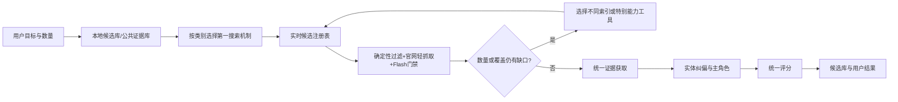

# Cudy 混合搜索策略

版本：`0.6.0-discussion`

状态：已确认部分设计，尚未实施到生产搜索路由

更新时间：2026-09-01

## 一、全局原则

1. 相同底层搜索引擎且检索机制相同的工具默认不重复调用。只有第二工具具有明确能力增量且可解决当前缺口时才允许调用，并记录例外理由。
2. 搜索阶段只生成最小候选记录，不生成最终主角色、评分、合作路径、开发策略、开发信或长篇公司分析。
3. 原搜索通道和provider只作为来源信息，不能决定公司最终主角色或分数。
4. 所有工具写入同一个实时候选注册表；同一公司只进入一次补证、角色识别和评分。
5. 已抓取页面和公开证据写入公共证据库，下游必须复用；用户私有知识和长期记忆继续隔离。
6. 用户明确指定50家或100家时，数量是任务完成目标，不是模型升级或评分Top-N触发器。
7. 普通数量目标默认统计去重后的`eligible`及可展示`research-required`公司；用户明确要求“已验证”时只统计`eligible`。`invalid`和重复实体不能凑数。
8. 未达到目标但连续两个不同批次或provider没有新增价值，且已无可解决缺口时，停止并报告差额，不降低质量标准。
9. 每个搜索、门禁、补证和评分环节必须记录输入、有效输出、下游采用、成本、延迟、重试、丢弃原因和优化机会。

## 二、统一工作流与实时去重



### 实时候选注册表

注册表至少使用以下身份信号合并公司：

- 规范化根域名
- 法律实体和Impressum
- 公司名称别名
- Google Place ID及母公司关系
- 总部、分支和Store Locator关系
- 已有公共证据库公司ID

双轨搜索采用小批次协调：每批完成后立即写入候选、来源、角色/地区缺口和重复率；下一批启动前读取最新注册表。支持排除域名的工具应接收已有域名集合。即使搜索引擎再次返回同一公司，系统也只增加provider来源，不创建第二个补证或评分任务。

并发任务使用`candidate/task lease`：同一规范化公司同时只能有一个身份核实、官网抓取或补证任务。其他轨道命中该公司时只追加来源和未覆盖URL。

## 三、搜索阶段最小输出契约

每条候选只保存：

- 公司名称、可能的法律实体，以及品牌/集团/区域运营主体的疑似关系
- 根域名、官网或待验证URL
- 来源URL、provider、查询和批次
- 地区、Place ID或分支关系（如有）
- 初步角色家族提示和简短命中信号
- 规范化键、去重状态和已有候选ID
- 尚缺证据类型

搜索阶段禁止输出最终角色、分数、路径、策略和邮件。搜索摘要不能直接成为评分事实；可验证URL交给统一证据流程读取。

搜索阶段也不深入判断品牌、集团、法律实体、区域运营主体和采购主体之间的最终关系。它只保存结构化关系提示、关系类型候选、来源URL及`unresolved`状态；后续证据与角色Agent负责核实，确定性程序再依据已核实关系执行实体归并、运营/采购主体选择和计数。

## 四、轻量候选门禁

适用于Places和其他高召回来源：

```text
确定性过滤
→ 普通HTTP官网轻量抓取
→ DeepSeek V4 Flash批量语义判断
→ 程序生成pass / hold / reject
```

- Kimi只负责用户意图和搜索模板检查，不承担候选门禁。
- 门禁不升级DeepSeek Pro；不确定候选进入`hold + Limited补证`。
- 模型只返回布尔值、枚举、reason code和缺失证据，不返回Confidence、最终角色或评分。
- 官网轻抓取内容立即进入公共证据库，后续不得重复抓取同一内容指纹。

## 五、工具能力与去重边界

| 工具 | 主要能力 | 默认重复边界 |
|---|---|---|
| Gemini Full式搜索 | 带完整任务上下文的规划式Google搜索 | 使用后不固定调用Product Gemini或SearchAPI Google |
| Product Gemini | 固定查询的Gemini Google Search Grounding | 仅未使用Gemini Full且确有语义发现价值时使用 |
| SearchAPI Google | 原始网页SERP、购物/精确操作符查询 | 不与同任务的Gemini Google机制固定并行 |
| SearchAPI Bing | 第二网页索引 | 仅索引缺口触发 |
| Brave | 独立网页索引 | 第一异构索引补充候选 |
| Google Places Local | 地图商户和地理实体 | 与网页索引不同；按地区/门店目标触发 |
| Exa | 专业语义页面、案例和partner页面 | 仅语义页面缺口触发 |
| Tavily Search/Extract | 已知公司的定向证据搜索和URL正文提取 | 统一放在证据阶段；已知URL直接Extract，不重复搜索 |

## 六、Distributor / VAD（已确认）

### 搜索目标

识别直接从品牌采购并向下级渠道供货的Distributor/VAD，验证dealer/reseller网络、品牌组合、库存物流和技术/市场赋能。Broadline、Networking VAD、Telecom/ISP及Industrial/Outdoor分销子类型都可成立，不设固定比例。

### 路由

```text
本地候选/证据库
→ 专用Gemini Full式规划搜索
→ Brave（索引缺口）
→ SearchAPI Bing（第二索引缺口）
→ Exa（专业partner/distribution页面缺口）
→ 统一证据阶段的Tavily Search/Extract
```

- 不调用Product Gemini。
- Google Places不用于一级分销主发现。
- Tavily不作为固定发现provider；partner locator等来源型任务也由统一证据阶段一次搜索、提取和复用。
- Gemini只发现候选和来源，最终Distributor/VAD角色由下游Agent决定。

## 七、Reseller / VAR / DVAR（已确认）

Reseller/VAR与Retailer/E-tailer彻底拆分查询模板。目标是向SMB或专业客户销售、报价、推荐或配置网络产品的公司。

### 全国/线上B2B轨道

```text
Product Gemini
→ Brave（索引缺口）
→ SearchAPI Bing（第二索引缺口）
→ Exa（VAR/solution专业页面缺口）
```

该轨道不调用Gemini Full，因此Product Gemini不构成同任务重复。

### 地方/区域B2B轨道

```text
Google Places Local
→ 轻量门禁
→ 必要时SearchAPI Google/Brave/Bing补网页或地区缺口
```

大数量或广覆盖任务可分批执行两轨，但必须实时反馈、去重，不能一次性盲目全并行。Tavily仅在统一证据阶段验证B2B客户、产品、报价/采购、VAR增值和品牌组合。

## 八、Retailer / E-tailer（已确认）

### E-tailer

```text
SearchAPI Google（商品、品牌和购物意图）
→ Brave（独立索引）
→ SearchAPI Bing（第二索引）
→ Product Gemini（仅无法用精确查询表达的复杂语义条件）
```

E-tailer具有`shop/kaufen/Preis/Warenkorb`和产品分类等强结构信号，原始SERP比规划模型更易控制、去重和度量。Product Gemini与Google机制重合，默认不调用。

### Retailer

- 地方门店和指定城市：Google Places Local优先。
- 全国连锁、集团官网和线上线下一体：SearchAPI Google优先。
- 两种机制按用户目标选择，只有另一类数据缺口时才组合。
- 默认按法律实体/集团计数，门店只作为覆盖证据；用户明确要求具体门店时才能单独保留。
- 自营或有直接采购控制的混合平台可以进入；纯第三方Marketplace、个人卖家和价格比较站不进入主候选池。

Retail/E-tail门禁允许消费者和SOHO业务，但必须有相关网络产品及真实采购、上架、销售或履约能力。Tavily仅在证据阶段工作。

## 九、SI / MSP（已确认）

SI/MSP保留同一候选类别，但分成全国/复杂项目和地方/SMB两条轨道，实时共享候选注册表。

### 全国/企业级/垂直行业轨道

```text
专用Gemini Full式规划搜索
→ Brave
→ SearchAPI Bing
→ Exa（案例、solution、managed service页面缺口）
```

不调用Product Gemini，不固定调用SearchAPI Google。

### 地方/区域/SMB轨道

```text
Google Places Local
→ SI/MSP专用Flash轻量门禁
→ SearchAPI Google（全国网页、母公司或行业缺口）
→ Brave/Bing（仍有索引缺口）
```

两轨按小批次运行：任一轨道发现公司后立即更新注册表；另一个轨道若命中同一公司只追加来源。搜索数量和轨道占比由用户的目标客户、地区和数量决定，不设固定配额。

Tavily在证据阶段验证客户群、网络场景、方案设计、项目结果、选型采购影响和持续托管能力。搜索来源不能强制公司归为SI或MSP。

## 十、Installer（已确认）

Installer承担现场布线、设备安装、基础配置、测试或交付，不要求具备完整SI方案设计能力，也不能因为只安装客户指定设备就在搜索门禁阶段被拒绝。

### 地方/区域轨道

```text
Google Places Local
→ Installer专用Flash轻量门禁
→ SearchAPI Google（官网、全国网页或专业服务缺口）
→ Brave/Bing（仍有索引缺口）
```

### 全国/多地区/专业轨道

```text
SearchAPI Google
→ Brave
→ SearchAPI Bing
→ Exa（案例和专业服务页面缺口）
```

- Gemini Full和Product Gemini不作为固定工具。复杂且模板无法表达的全国垂直任务使用Gemini Full时，不再固定调用SearchAPI Google。
- Installer门禁关注企业网络布线、WLAN/AP安装、配置、测试、交付和B端客户；普通家用电工、家电安装、维修和无网络能力的纯安防公司不通过。
- 采购/推荐影响在后续评分处理，不作为搜索角色门禁。
- Installer与SI/MSP共享实时候选注册表、官网内容和任务租约；同一公司只增加角色/来源，不重复补证或评分。
- Tavily只在统一证据阶段验证现场责任、客户、场景、设备影响、案例和地区，已有URL直接Extract。

## 十一、ISP / WISP / 区域电信（已确认）

ISP类目标是识别实际提供Internet、宽带、光纤或固定无线接入服务的运营商，以及可能采购、选型或部署CPE、路由器、Mesh、交换机和无线网络设备的运营主体。搜索阶段不把电话卡零售商、资费代理、比较网站、纯施工承包商或纯Hosting公司混入运营商候选。

### 战略型/全国型/复杂运营商轨道

```text
专用Gemini Full式规划搜索
→ Brave（异构索引缺口）
→ SearchAPI Bing（第二索引缺口）
→ Exa（技术、CPE、网络或专业页面缺口）
```

- 不调用Product Gemini，也不固定调用SearchAPI Google。
- Gemini只发现候选、结构化疑似关系和来源，不判断最终运营/采购实体。

### 区域ISP/WISP轨道

```text
SearchAPI Google + 主管机构/运营商名录等权威来源
→ Google Places Local（仅地方覆盖或本地实体缺口）
→ Brave（异构索引缺口）
→ SearchAPI Bing（第二索引缺口）
```

- Product Gemini不作为固定工具。
- 权威HTML或PDF名录不建立独立工作流：在统一证据阶段发现URL，先做价值门禁，再按HTML直取或PDF分级提取，候选写入同一注册表并进入同一下游流程。
- PDF默认先用`pypdf`提取文本；表格或版面复杂时升级`pdfplumber`；仅对确有价值且文本层不足的相关页执行OCR。提取过程中可根据已取得内容提前停止，不为低价值文档升级预算。

### ISP专用轻量门禁和实体边界

- `pass`：存在Internet/宽带/光纤/FWA运营、覆盖范围、资费、网络或CPE等实际信号。
- `hold`：Stadtwerke与运营主体关系不清、代理与运营商不清、Hosting与接入业务混合，或证据有限。
- `reject`：纯电话/资费零售、代理或比较网站、仅光纤施工、纯Hosting、公共免费Wi-Fi。
- 搜索阶段只记录品牌、集团、法律实体、区域子公司或运营主体的疑似关系和来源，不做深入归并或采购主体判断。
- 后续证据与角色Agent完成关系核实；确定性程序按核实结果合并门店/重复实体并统计实际运营或采购主体。
- ISP与全部其他轨道共享候选注册表、公共证据、内容指纹和任务租约；同一公司不重复补证、角色判断或评分。
- 目标数量较小时，战略型轨道按任务需要少量调用Gemini；50家或100家等区域性任务先扩展SearchAPI Google和权威来源，再用Places补地方覆盖缺口。
- Tavily只在统一证据阶段验证运营资质、覆盖、技术、CPE、采购和实体关系；已有URL直接Extract。

## 十二、待讨论类别

- Agent、OEM/ODM和其他特殊类型

这些类别确认前不得从相邻类别机械复制工具组合或门禁标准。
