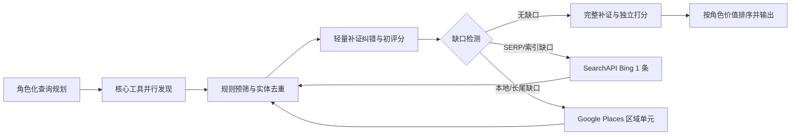

# v1.5 混合搜索策略与低分入榜线索审计

- 数据基线：`2026-08-27-de-v1.3` / `end-to-end-candidate-value-v1.5`
- 分析日期：2026-08-28
- 性质：冻结结果的产品策略设计与评分审计，不是一次新增外部搜索测评
- 目标：在最终线索价值优先的前提下，以尽可能低的发现与补证成本超过 Gemini Full

## 结论

产品不应固定并行调用所有搜索工具。最优默认方案是“按角色选择核心组合，统一纠错打分，再按缺口自适应调用 Bing 或 Google Places Local”。

冻结候选池的产品工具全量并集，经规范化实体去重后，各通道 Top 10 的追溯上限为：一级渠道 72.64、B2B 转售 86.88、项目服务 85.04，宏平均 81.52。这个结果比 Gemini Full 的 65.31 高 16.21 分，证明混合发现有足够的潜在增量；但它是已知候选池上的 oracle 上限，不能当作前瞻实测结果。

一级渠道是当前明确短板。全部产品工具并集仍只有 72.64，而 Gemini Full 达到 91.28。因此一级渠道应把 Gemini 的完整规划式、带搜索依据的发现作为主通道，并行补充 Exa；B2B 转售优先 Gemini discovery + Exa；项目服务优先 Exa + Tavily。Google Places Local 不应承担全国一级分销商发现，而应专门用于本地 Reseller、VAR、Installer、SI 和区域 ISP 的长尾扩展。

Bing 应通过现有 SearchAPI.io 接入为自适应第二搜索引擎。它只在候选数量、质量、合作路径证据或地域/长尾覆盖不足时启动，每个角色包先执行一条 Bing 查询，评估增量后才允许第二条。这样能获得不同索引的增量，同时避免 Google 与 Bing 每次双跑造成固定成本和重复候选。

低分审计同时发现 v1.5 排名仍不能视为最终公平结论：12 条已入榜但低于 50 分的记录对应 6 家真实公司，其中至少 4 家与官网直接证据明显矛盾。v1.5 的追溯函数只纠正角色和路由，却继续继承旧的产品匹配、合作路径和置信度等级。因此本报告的混合策略可作为下一轮实现基线，但修复后必须生成 v1.6 重评分和敏感性报告；Exa、Tavily 等找到这些公司的工具很可能被当前排名低估。

## 一、v1.5 对混合策略的直接证据

### 1. 单工具的角色差异

| 发现方式 | 一级渠道 | B2B 转售 | 项目服务 | 最适合承担的职责 |
|---|---:|---:|---:|---|
| Gemini Full | 91.28 | 58.64 | 46.00 | 一级 Distributor / VAD 的规划式发现基准 |
| Google Places Local | 38.88 | 72.32 | 77.84 | 本地长尾 Reseller、Installer、SI、ISP |
| Exa | 42.08 | 46.24 | 65.84 | 各通道专业公司与语义相关页面发现 |
| Tavily | 16.48 | 47.36 | 63.28 | 项目服务、官网业务描述和补证 |
| Product Gemini | 30.16 | 62.96 | 18.32 | B2B 转售候选；当前 discovery-only prompt 不适合项目服务 |
| Brave | 22.16 | 32.96 | 50.08 | 低成本补充不同独立索引结果 |
| SearchAPI Google | 17.36 | 30.80 | 50.08 | 低成本 SERP 和精确操作符搜索，不适合单独承担主发现 |

Google Places Local 在 B2B 转售中找到 21 个有效唯一候选，其中 19 个没有被其余产品工具找到；在项目服务中找到 29 个，其中 27 个为独有候选。这种独有率说明它对小型本地公司很重要，但并不表示这些公司都应进入最终 Top 10。它更适合作为长尾候选池，而不是直接把数百条地图结果送入昂贵的模型补证。

### 2. 工具组合的追溯上限

| 通道 | 低成本质量核心 | 固定十槽得分 | 基准发现请求 | 产品全并集上限 | Gemini Full |
|---|---|---:|---:|---:|---:|
| 一级渠道 | Product Gemini + Exa | 68.88 | 6 | 72.64 | 91.28 |
| B2B 转售 | Product Gemini + Exa | 83.52 | 6 | 86.88 | 58.64 |
| 项目服务 | Exa + Tavily | 81.36 | 6 | 85.04 | 46.00 |

“基准发现请求”沿用 v1.5 每个普通工具每通道三条查询的协议，仅用于相对比较。一级渠道表明：继续堆叠当前通用搜索工具收益很小——从两工具的 68.88 增加到六工具并集的 72.64，只增加 3.76 分。问题不在工具数量，而在一级渠道查询规划和数据源选择。

B2B 转售从 Gemini + Exa 的 83.52 增加到 Gemini + Tavily + Exa + Brave 的 86.88，十二次发现请求后已经达到全并集上限；SearchAPI Google 和 Google Places Local 没有再提高这个冻结 Top 10，但 Places 提供了大量独有长尾候选。

项目服务从 Exa 的 65.84 增加到 Exa + Tavily 的 81.36，六次请求就获得主要增量；继续加入第三个普通搜索工具只能提高到 83.12。Google Places Local + Tavily 可达到 83.36，并把有效唯一候选池扩展到 38 家，适合需要地方覆盖或小型 Installer 的任务。

## 二、推荐的产品搜索编排

### 1. Distributor / VAD

核心通道并行执行：

1. Gemini 使用接近 Gemini Full 的完整一级渠道任务，而不是只返回裸候选 URL。要求它围绕 Distributor/VAD、下级渠道网络、品牌直接采购可能性、厂商组合与德国经营证据规划搜索。
2. Exa 使用三类精确查询：网络设备 distributor/VAD、相邻品牌的德国 distributor/partner、面向 reseller/dealer 的采购或伙伴页面。

不默认执行全国 Google Places 网格。地图搜索在该通道只有 38.88，且容易返回食品、电气材料、物流等名称含“distribution/wholesale”的噪声。

若核心结果不足，先调用 SearchAPI Bing；仍有缺口时再用 Tavily 对厂商 partner locator、`where to buy`、品牌组合和经销商申请页面补证。一级渠道的最终发布池应至少有 12 个通过候选，保证 Top 10 之外有两个候补。

### 2. Reseller / VAR / DVAR / Dealer

默认质量核心是 Product Gemini + Exa。v1.5 冻结池中两者组合已达到 83.52，明显高于任一单工具。查询应拆成三种意图：

- 真实 B2B 商品交易页或 web shop；
- 为 SMB 客户采购、报价、部署 networking hardware 的 Systemhaus/VAR；
- 与 Cudy 邻近品牌或产品族的 reseller/dealer/partner 页面。

当用户明确要求小公司、地方渠道或指定城市时，同时启动 Google Places Local；普通全国任务则在核心候选不足或长尾占比不足时才启动区域网格。SearchAPI Google 可以承担精确 `site:`、`inurl:shop`、品牌词与产品词查询；它在 v1.5 没有提供独有有效 B2B 候选，因此不应再作为固定并行主通道。

Bing 主要补以下缺口：Google 排名较弱的小型 web shop、地方 Systemhaus、marketplace 官方店铺、只被 Bing 收录的产品/伙伴页。平台本身与平台内商家继续作为不同实体去重。

### 3. SI / Installer / ISP

企业级 SI 或跨区域项目服务使用 Exa + Tavily；该组合六次基准请求达到 81.36。小型 Installer、本地 SI 和区域 ISP 使用 Tavily + Google Places Local；该组合达到 83.36，并能把有效唯一候选池扩大到 38 家。

Google Places 应按区域单元逐批运行，不一次扫描全国全部网格。先取四个优先区域，每个区域保留少量高相关候选；如果用户要求全国覆盖、有效候选不足或地域过度集中，再扩到其余区域。地图候选先通过名称、类别、网站域名和 networking 关键词做便宜的规则预筛，之后才进入网页解析和模型补证。

Installer 的合作路径不能仅凭“提供安装”直接打满：需要继续区分候选是自带设备、代客户选型、提出建议，还是只安装客户指定设备。ISP 则重点补证 CPE/AP/router 选型、网络部署和采购影响力。

### 4. E-tailer / Retailer 与佣金型 Agent

这两类不在 v1.5 三通道独立测评范围内，因此策略是待验证假设，不能引用本轮分数宣称优劣。

- E-tailer / Retailer：SearchAPI Google 商品与购物意图查询为主，SearchAPI Bing 自适应补充，必要时用 Google Places 发现线下门店；同一公司的线上与线下业务可以保留多角色。
- 佣金型 Agent：Gemini/Exa 搜索品牌代表、manufacturer representative、sales agency、代理协议和服务市场；不与一级 Distributor 合并，也不使用 Google Places 作为主发现。

## 三、Bing 自适应第二搜索通道

### 接入方式

使用现有 SearchAPI.io，新增 [`engine=bing`](https://www.searchapi.io/docs/bing) provider variant，保留 `market=de-DE`、德国位置和德语/英语双语查询。不要接入[已经退役的旧 Microsoft Bing Search API](https://learn.microsoft.com/en-au/lifecycle/announcements/bing-search-api-retirement)；[Microsoft Foundry 的 Bing Grounding](https://learn.microsoft.com/en-us/azure/foundry/agents/how-to/tools/bing-tools)返回的是带引用回答且不向开发者暴露原始搜索工具输出，也不适合本产品的候选池去重、证据归属和独立打分。

Bing 必须在独立评测分支完成同一冻结协议测评后，才有资格升级成默认回退通道。v1.5 没有 Bing 数据，本报告不为它虚构质量分。

### 触发条件

任一条件成立即可启动第一条 Bing 查询：

- 纠错后有效唯一候选少于目标数的 1.2 倍；Top 10 任务即少于 12 家；
- 可发布候选少于 10 家，或第 10 名低于 60 分；
- 超过 30% 的候选合作路径等级不高于 2；
- 一级渠道中具有明确下级渠道、品牌组合或直接采购信号的候选少于 8 家；
- 下级渠道任务要求长尾/地方覆盖，但候选集中在少数大公司或少于四个目标区域；
- Google/Exa 结果域名重复率超过 60%，说明同一索引面已接近饱和；
- 需要查找 marketplace 店铺、具体品牌 partner 页面或特定本地公司，而核心通道没有命中。

### 停止条件

第一条 Bing 查询返回后立即做规范化、去重和轻量纠错，不等待第二条：

- 若没有新增通过候选，停止；
- 若新增候选不能进入当前 Top 15 且没有填补角色/地域缺口，停止；
- 若新增至少两家有效唯一候选，或至少一家候选使预计 Top 10 总分增加 4 分以上，可执行第二条互补查询；
- 每个角色包最多两条 Bing 查询。第二条完成后无条件停止，除非用户明确选择“深度搜索”。

Bing 查询必须与第一通道互补，而不是原句复制。例如一级渠道第一条查 `network distributor/VAD Germany reseller partner`，第二条改查邻近品牌的 distributor/where-to-buy；Installer 则从行业词切换为城市 + WLAN/mesh/access point 安装与选型词。

## 四、搜索成本设计

以下为 2026-08-28 官方公开价格下的边际发现成本估算，不含模型 token、网页抓取、补证纠错和数据库成本；免费额度与订阅最低消费会改变实际账单。

| 工具 | 公开单价 | v1.5 每通道调用 | 估算边际成本/通道 | 设计含义 |
|---|---:|---:|---:|---|
| SearchAPI Google/Bing | Developer 约 $4/1,000 次成功搜索 | 3 | $0.012 | 适合按需 SERP 与 Bing 回退 |
| Brave Search | $5/1,000 requests | 3 | $0.015 | 低成本独立索引补充 |
| Tavily Advanced | 2 credits/次；PAYG $0.008/credit | 3 | $0.048 | 项目服务发现和补证性片段 |
| Exa Search + 10 页 text | $0.007/search + $0.001/page | 3 | 约 $0.051 | 高质量语义发现，成本仍低于人工筛选 |
| Google Places Text Search Pro | 免费上限后 $32/1,000 | 8 | $0.256 | 只用于下级本地渠道并分批启动 |
| Gemini 3 Google Search Grounding | 5,000 免费 search requests/月后 $14/1,000，另计模型 token | 取决于模型实际搜索次数 | 运行后核算 | 一级渠道质量优先；记录真实 grounding query 数 |

价格来源：[SearchAPI pricing](https://www.searchapi.io/pricing)、[Brave Search API](https://brave.com/search/api/)、[Tavily credits](https://docs.tavily.com/documentation/api-credits)、[Exa API pricing](https://exa.ai/pricing?tab=api)、[Google Maps Platform pricing](https://developers.google.com/maps/billing-and-pricing/pricing)、[Gemini API pricing](https://ai.google.dev/gemini-api/docs/pricing)。

从账单角度看，发现 API 本身通常不是最大成本；将大量噪声候选送入网页抓取和模型补证才是主要浪费。Google Places Local 在本轮产生 396 条最终记录，仅 57 条通过，因此必须先规则预筛、实体去重和分批补证。成本控制应优化“每个新增可发布唯一候选的端到端成本”，而不是只优化 API 单价。

### 应记录的生产指标

每个 provider、角色包和搜索阶段都记录：

- 外部请求数、实际费用、延迟和失败重试；
- 原始候选数、规范化唯一公司数、通过硬门槛数、可发布数；
- 新增有效唯一候选率和与已有池的重复率；
- 对最终 Top 10 的入榜数、总分增量和最低分提升；
- 补证网页数、模型 token、单条可发布线索的完整端到端成本；
- Bing/Places 的触发原因、停止原因和未执行时节省的预计成本。

以 `增量 Top10 分数 / 增量端到端成本` 和 `新增可发布唯一候选 / 增量端到端成本` 为主要效率指标。单工具总分仍用于离线能力诊断，但不再直接决定生产编排。

## 五、实施顺序与验收

1. 在测评分支新增 SearchAPI Bing provider variant，保持与 SearchAPI Google 完全相同的候选标准化输出。
2. 按三通道冻结输入独立测评 Bing，报告质量、独有有效候选、与 Google/Exa/Places 的重合率和真实请求成本。
3. 实现角色化 provider policy 和缺口检测器；先只记录“本应触发哪个 fallback”，不自动调用，用历史任务回放验证阈值。
4. 启用 Bing 单次回退和 Google Places 分区域回退；将每次增量写入审计日志。
5. 进行前瞻端到端 A/B：固定全并行策略对比自适应策略。验收要求是三通道宏平均不低于全并行策略 98%，同时外部发现与补证总成本至少下降 30%。
6. 最终与 Gemini Full 进行同输入、同目标槽位、同人工校准标准的正式对照。一级渠道必须单独不低于 Gemini Full，而不是仅靠下级渠道的高分掩盖短板。

## 六、低于 50 分的入榜候选审计

### 1. 审计口径和总体分布

本节只统计 v1.5 leaderboard 每个 `channel.selected` 中 `0 < score < 50` 的记录，即已经通过三个真实价值硬门槛并进入该工具对应通道 Top 10 的线索；不包含 0 分未通过候选，也不包含通过但未入榜候选。

共有 12 个入榜出现次数，对应 6 家唯一公司，平均 40.07 分。Gemini Full 没有低于 50 分的入榜记录。

| 分组 | 低分入榜出现次数 |
|---|---:|
| Exa | 4 |
| Tavily | 3 |
| Brave | 2 |
| Product Gemini | 1 |
| SearchAPI | 1 |
| Google Places Local | 1 |
| 一级渠道 | 5 |
| 项目服务 | 7 |
| B2B 转售 | 0 |

评分形态只有两种：5 条为 `产品匹配1 / 合作路径2 / 置信度3`，7 条为 `2 / 2 / 3`。各组件平均分与相对满分损失如下：

| 维度 | 平均得分 | 满分 | 平均损失 |
|---|---:|---:|---:|
| 产品与应用场景匹配 | 13.93 | 44 | 30.07 |
| 合作路径与购买影响力 | 12.80 | 32 | 19.20 |
| 独立信息可信度 | 12.00 | 20 | 8.00 |
| 角色识别 | 1.00 | 3 | 2.00 |
| 通道归类 | 0.33 | 1 | 0.67 |

低分的主因是产品匹配和合作路径，而不是角色/通道的 4 分权重。12 条中有 8 条没有识别出任何支持角色，但即使补回全部角色与通道分，也只能增加 4 分，无法解释这些公司的整体低估。11/12 的供应方证据完整；该指标本来也是零权重，因此“供应方没有按格式提交证据”同样不是主因。

### 2. 六家公司逐条复核

| 公司 | 出现工具/次数 | 当前评分 | 官网事实与判断 | 审计结论 |
|---|---|---:|---|---|
| [4Networks IT-Distribution](https://www.4networks.de/) | Exa、Tavily、SearchAPI / 3 | 37.6（1/2/3，角色通道满分） | 官网明示 Value Add Distributor / IT-Distributor，厂商含 Cambium、MikroTik、Ruckus、Teltonika、Ubiquiti/UniFi、Zyxel，并说明营销、分销网络产品和交付服务；旧盲评已给 5/4/4 | 明确严重低估，fit/path 与证据冲突 |
| [Teamtrade IT GmbH](https://www.team-it-group.de/teamtrade) | Exa、Google Places Local / 2 | 33.6（1/2/3，角色通道0） | 官网明示“Omada Distributor für Systemhäuser / Value-Add Partner”，并经营网络技术分销和 HPE value-reselling；当前却没有识别任何角色 | 明确错评，角色、fit、path 同时低估 |
| [Frings Solutions Deutschland GmbH](https://frings-solutions.de/) | Exa、Tavily、Product Gemini、Brave / 4 | 42.4（2/2/3，角色通道0） | 官网展示 Networks/WLAN、switch/router、WLAN 规划、AP 安装配置、IT Shop 以及 Cisco/HPE Aruba/Extreme 合作；旧盲评已给 5/5/4 | 明确严重低估 |
| [Die Netz-Werker AG](https://www.die-netz-werker.de/) | Tavily / 1 | 42.4（2/2/3，角色通道0） | 官网明确提供网络/WLAN 规划、实施和管理，发现材料还指向 Ruckus/Ubiquiti 方案 | 高概率低估，至少应识别 SI/Installer 与项目控制动作 |
| [HANSA PROJEKT](https://www.hansaprojekt.de/) | Brave / 1 | 42.4（2/2/3，角色通道0） | 官网称长期为商业和工业客户设计、实施网络结构，列出 switch/router/WLAN、网络管理以及安装岗位 | 明确低估；企业/工业定位可以扣 fit，但不能抹去产品与实施事实 |
| [SHC Netzwerktechnik GmbH](https://www.shc-netzwerktechnik.de/) | Exa / 1 | 46.4（2/2/3，角色通道满分） | 高端 Arista/数据中心定位使 fit=2 可能合理，但官网明确覆盖咨询、项目规划、采购、集成和培训 | 合作路径明显低估；产品匹配需保留细分市场折扣 |

为了判断是否可能跨过 50 分，审计做了保守复核区间推演，但没有把这些区间写回正式分数：4Networks 约 85.6–89.6、Teamtrade 约 85.6–96、Frings 约 76.8–96、Die Netz-Werker 和 HANSA 约 76.8、SHC 约 59.2–65.6。这些不是新的正式裁决，只说明六家公司均有实质性越过 50 分的可能，必须用统一的新评分 Agent 重跑。

### 3. 系统性根因

第一，v1.5 没有在补证纠错之后重算价值维度。`evaluateV15EndToEnd` 从共享 dossier 重新得到角色与路由，却在 `productUseCaseFit`、`cooperationPath` 和 `independentInformationConfidence` 三项直接读取 `baseline.levels`。因此“补证纠错后的端到端价值”只在分类层完成，价值层仍是旧分。

第二，旧确定性规则对德语词形和自然语序覆盖不足。`Distributor für …` 中间插入公司类型、`Value-Add Partner`、`Projektierung`、`Beschaffung`、`Implementierung`、`Verwaltung`、`Netzwerkstrukturen` 等明确业务动作可能不命中窄正则或固定字符窗口，造成角色为空、合作路径封顶 2。

第三，产品 fit 存在企业级短路。只要证据出现 data center、campus 等企业词，又没有显式 SMB 词，规则会在统计两到三个 Cudy 相关产品族之前直接返回 fit=2。综合型 SI 或企业网络商即使同时明确销售/部署 AP、switch、router、WLAN，也会被整体压低。细分市场偏高端应该是有限扣分，不应覆盖已证明的产品族和应用动作。

第四，发现摘要与共享补证之间存在证据丢失。动态官网直接抓取失败或没有保留核心正文时，供应方摘要不能用于正式评分，而共享补证又未复现精确内容，最终把“证据获取未完成”错误转化为“业务能力弱”。正确状态应是 `evidence acquisition unresolved` 并触发第二抓取方式，而不是负面事实。

第五，评分基础不对称。全部 12 条低分记录都来自 `v1.3.1-shared-evidence`。所有入榜记录中，这种评分基础共有 100 条、低分 12 条；`v1.4-independent-adjudication` 共有 37 条、低分 0 条。这个分布单独不能证明偏差，但与六家公司官网反证结合后，是明显的公平性警报。Gemini Full 和产品候选必须经过相同的最终补证与独立评分流程。

### 4. 对当前评分体系的判断

44/32/20/3/1 的权重方向没有被本次审计否定。它正确地让产品匹配与合作路径决定主要价值，并把分类成本压到 4%。问题发生在权重之前：证据是否被获取、事实是否被识别、等级是否在纠错后重新计算。

因此结论不是“可能偶发低估”，而是 v1.5 对这组低分入榜候选存在已经得到反证支持的系统性低估。它还会进一步影响工具排名：4Networks、Frings 等分别被多个工具发现，同一错误会重复压低 Exa、Tavily、Brave、SearchAPI 和 Product Gemini，而 Gemini Full 的候选更多采用独立裁决基础。

当前产品工作流中的 Qualification Agent 已经设计成读取纠错后候选、忽略 provider 排名并独立给五维分，不会直接继承 v1.5 的 baseline levels；但它仍用确定性 `assessCooperationPathEvidence` 结果给模型合作路径分设上限，因此德语正则漏判仍可能把正确模型判断压回低分。产品实现方向正确，但还没有完全消除本次发现的风险。

### 5. 修正建议

1. 补证纠错 Agent 输出结构化事实：产品族、用例、角色业务动作、采购/选型/报价/部署信号和逐项来源；Qualification Agent 必须从这些事实独立重算全部五维，测评脚本禁止继承旧 fit/path/confidence。
2. 确定性正则只做异常检测和保守 fallback，不再静默覆盖模型评分。补齐上述德语词形/语序，并把六家公司做成回归 fixtures。
3. 取消“出现任一 enterprise 词就把整家公司 fit 压到 2”的全局短路；先计算 Cudy 相关产品族和应用动作，再把 segment mismatch 作为有限扣分或单独展示字段。
4. 精确发现页抓取失败或正文缺失时，自动改用 Tavily Extract、Exa Contents 或 browser-render 补抓；未完成时标记为未知并二次审查。
5. Gemini Full 和全部产品候选统一走同一补证、结构化事实和最终 scorer；如果保留人工裁决，也必须采用相同比例和抽样规则。
6. 增加低分异常规则：三个硬门槛全过且 fit/path 均不高于 2，但证据中存在明确 Distributor、规划、采购、选型、安装、品牌或产品动作时，强制进入升级模型复核。
7. 修复后生成 v1.6，全量重评并披露工具排名敏感性。在 v1.6 完成前，v1.5 排名只能用于策略方向，不能作为最终工具采购或淘汰依据。

## 数据与可复现性

- v1.5 全量评分：`artifacts/runs/2026-08-27-de-v1.3/scoring/end-to-end-value-v1.5/all-candidate-scores.v1.5.json`
- v1.5 排行榜：`artifacts/runs/2026-08-27-de-v1.3/scoring/end-to-end-value-v1.5/leaderboard-end-to-end-value.v1.5.json`
- 本报告派生统计：`artifacts/runs/2026-08-27-de-v1.3/analysis/hybrid-search-strategy-v1.5.json`
- 生成脚本：`scripts/analyze-v1.5-hybrid-strategy.ts`
- 复现命令：`npm run benchmark:v1.5:analyze-hybrid`

派生统计明确区分“冻结候选池 oracle 并集”与“生产可实现结果”。Bing、E-tailer/Retailer 和佣金型 Agent 尚未在 v1.5 中得到独立分数，后续实验不得把本报告中的策略假设写成已验证结论。
